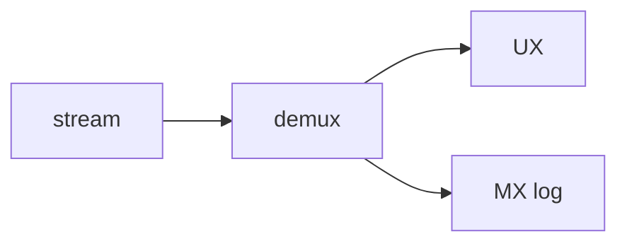

# 10: Machine experience vs user experience

After this page you can say which payload is for the model and which is for the person.

## Data
- MX: tool JSON, traces, `<think>`
- UX: visible tokens, buttons, errors in one sentence

## Information
Do not dump MX into the page. Demux first (chapter 12).

## Knowledge
1. Split channels.
2. Show UX.
3. Log MX.

## Wisdom
A debug panel can show MX. The main view should not.

## The When and Why
- **When:** you have both a model stream and a person.
- **Why:** mixing them looks like a broken UI.

## How it works

## Data contract
UX frame: `{ "type": "token", "text": "string" }`

## Lab
No extra lab. Use the SSE lab.

## Related
- **Chapter 12 CoT demux:** the splitter.

## Notes
Moved from modules/05/03.
