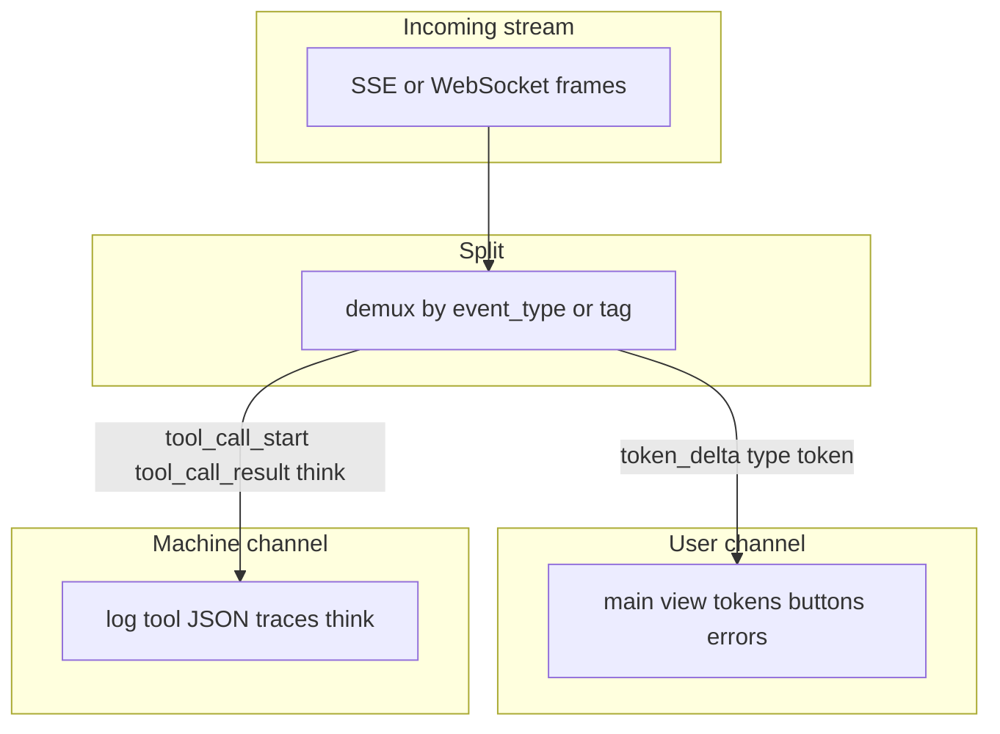

# 10: Machine experience vs user experience

After this page you can say which payload is for the model and which is for the person. The lab tags frames `ux` or `mx` and prints two streams.

## Data
**MX** (machine experience) is the payload the model and the tools need. In this chapter that means tool JSON, traces, and `<think>` blocks. A trace is a log of what the loop did (which tool, which args, which error). `<think>` is text the model produces for itself before the visible answer. Chapter 12 strips it.

**UX** (user experience) is the payload the person needs. Visible tokens, buttons, and errors in one sentence.

A **channel** is one stream of frames with one job. MX and UX are two channels. They can share one HTTP connection if you tag each frame. They must not share one text box.

**Demux** means split one incoming stream into those two channels. Chapter 12 does the CoT (chain-of-thought) split. This page only names the two sides. Lab 4 tags a fixture by `type` / `event_type`, or splits a string once on `<think>` / `</think>`. It does not copy `CoTStreamDemuxer`.

Lab 4 is `lab4_mx_vs_ux.py`. Functions: `tag_frame(frame)` returns `{ "channel": "ux" }` or `{ "channel": "mx" }`. `split_think_fence(text)` returns `{ "ux", "mx" }`. `split_streams(frames)` returns `{ "ux": [strings], "mx": [strings] }`. The SSE lab yields both MX-like frames (`tool_call_start`, `tool_call_result`) and UX-like frames (`token_delta`). `OLLAMA_HOST` defaults to `http://192.168.1.29:11434`. `OLLAMA_MODEL` defaults to `qwen3.6:35b-a3b-65k`. Port `11434` is Ollama. Lab 4 does not POST.

## Information
If you dump MX into the page, the person sees tool JSON and `<think>` text. That looks like a broken UI. It is not a model bug. The page drew the wrong channel.

A debug panel can show MX. The main view should not. Split first. Then draw UX. Log MX.

## Knowledge
1. Tag each frame as MX or UX, or put them on two routes.
2. Show UX on the main view: tokens, buttons, one-sentence errors.
3. Log MX: tool JSON, traces, `<think>`.
4. Do not print `tool_call_start` args or `<think>` into the same string as `token_delta`.
5. Do not write the chapter 12 splitter here. Name the two channels. Lab 4 is the tag and the fence split only.

## Wisdom
Stop when you can point at a frame and say MX or UX. Do not build the demuxer or a debug panel yet. If you add them now, a leaked `<think>` block could come from the splitter or from the page.

## The When and Why
- **When:** you have both a model stream and a person watching a page.
- **Why:** mixing MX and UX looks like a broken UI. The person asked for tokens, not tool JSON.

## How it works



Walkthrough of the frames lab 1 already yields:

1. `session_started` is MX (session status). Log it. Do not draw it as chat text.
2. `token_delta` with `data.delta` is UX. Append it to the visible string.
3. `tool_call_start` with `tool_name` `read_file` and `args.path` `config.json` is MX. Log it. A debug panel may show the name. The main view should not dump the args JSON.
4. `tool_call_result` with `output` `{'env': 'prod'}` is MX. Same rule.
5. `turn_complete` is MX status. The UX side can show "done" in one sentence. It should not dump `total_events`.

Walkthrough of lab 4:

1. `tag_frame` reads `type` or `event_type` and returns `{ "channel": "ux" }` or `{ "channel": "mx" }`.
2. `split_streams` puts token text on the ux list and dumps tool / session frames on the mx list.
3. `split_think_fence` cuts `<think>plan the answer</think>The env is prod.` into `mx` `plan the answer` and `ux` `The env is prod.`.
4. The joined ux string must not contain `config.json` or `<think>`.

The new fact is two channels. The splitter is chapter 12.

## Data contract

**Channel tag**

```json
{ "channel": "ux" }
```

or

```json
{ "channel": "mx" }
```

**Intended UX frame**

```json
{ "type": "token", "text": "string" }
```

**Intended MX frame** (not drawn on the main view)

```json
{ "type": "tool", "tool_name": "string", "args": {} }
```

**Fence result** (lab 4)

```json
{ "ux": "The env is prod.", "mx": "plan the answer" }
```

Lab 1 does not use `type` / `text`. It uses `event_type` and `data.delta`. See Notes.

## Lab
Done when two streams print and the joined ux string has no tool args and no `<think>`.

- Module: [this file](./02_mx_vs_ux.md)
- Lab 1: [lab1_sse_streaming_api.md](./lab1_sse_streaming_api.md) - mixed frames. Point at each `event_type`.
- Lab 4: [lab4_mx_vs_ux.md](./lab4_mx_vs_ux.md) - write `lab4_mx_vs_ux.py`. `tag_frame`, `split_think_fence`, `split_streams`. Done when UX prints `Hello ` / `world` / `The env is prod.` and MX holds the tool frames plus `plan the answer`.
- Chapter 12: [lab1_cot_demuxer.md](../12_reliability/lab1_cot_demuxer.md) - the CoT demuxer. Not this page.

## Related
- **Chapter 12 CoT demux:** the splitter for `<think>` vs visible text.
- **01_frontend.md:** the page that must draw only UX on the main view.
- **00_fastapi_sse.md:** the frames that arrive mixed.

## Notes
- Keep the existing ideas: MX is tool JSON, traces, and `<think>`. UX is visible tokens, buttons, and one-sentence errors. A debug panel can show MX. The main view should not.
- Lab 4 has no reference `.py` yet. Lab 1 already mixes MX and UX in one generator. The intended UX key is `{ "type": "token", "text": "string" }`. The script uses `event_type` `token_delta` and `data.delta`. Lab 4 accepts both. Do not copy `CoTStreamDemuxer`. Do not edit the `.py` files in the repo.
- Moved from modules/05/03.
