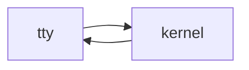

# 10: CLI harness

After this page a terminal is another client of the same loop.

## Data
- stdin / stdout / TTY
- HITL as a y/n prompt

## Information
Same kernel, no browser.

## Knowledge
1. Read a line.
2. Run a turn.
3. Print tokens.
4. Prompt before writes.

## Wisdom
CLI is enough for labs. A TUI is optional.

## The When and Why
- **When:** you are in a terminal.
- **Why:** HTTP is not required for the loop.

## How it works

## Data contract
Same session JSON as chapter 07.

## Lab
No extra lab required.

## Related
- **Chapter 07 kernel:** the process.

## Notes
Moved from modules/17.
