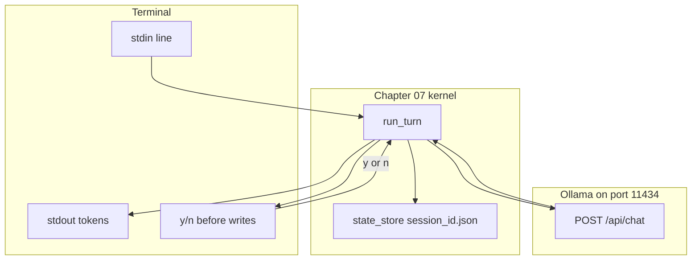

# 10: CLI harness

After this page a terminal is another client of the same loop. The lab is a stdin/stdout script that calls `run_turn` (mocked) and asks y/n on a high-risk line.

## Data
A **CLI harness** is a script that reads a line from the keyboard and prints tokens to the terminal. It calls the same kernel as the HTTP front door. It does not open FastAPI or a browser.

**stdin** is the stream the terminal sends into the process (what you type). **stdout** is the stream the process prints. A **TTY** is the terminal device that connects those two streams to a person.

**HITL** (human in the loop) on a CLI is a yes/no prompt before a write. Example: print `Apply write to config.json? [y/n]` and read one line. Chapter 09 does the gate object. This page only says the prompt is the UI. Lab 5 uses `apply_hitl(turn, answer)` and a fixture list so the script does not hang on `input()`.

The kernel is chapter 07: `CoreAgentKernel.run_turn(session_id, user_prompt)` and session JSON at `state_store/{session_id}.json` with keys `session_id`, `messages`, `turn_count`. Lab 5 does not copy that class. It calls `mock_run_turn` with the same return keys plus `high_risk` and `tool`.

Lab 5 is `lab5_cli_harness.py`. Functions: `mock_run_turn`, `apply_hitl`, `run_cli`. Labs 1 and 2 are HTTP frames. `OLLAMA_HOST` defaults to `http://192.168.1.29:11434`. `OLLAMA_MODEL` defaults to `qwen3.6:35b-a3b-65k`. Port `11434` is Ollama. The CLI does not need port `8000`. Lab 5 does not POST.

## Information
HTTP is not required for the loop. The loop is `run_turn`. FastAPI and `EventSource` are one client. `input()` and `print` are another client.

A TUI (text UI with panels) is optional. A line-oriented CLI is enough for labs.

## Knowledge
1. Read a line from stdin (`input()` or `sys.stdin.readline`). Lab 5 walks a list of strings instead so the run is non-interactive.
2. Call `run_turn(session_id, line)` on the chapter 07 kernel, or `mock_run_turn` in lab 5.
3. Print the `response` field (and tokens if you stream).
4. Before a write tool, print a y/n prompt and wait. Do not call the tool on `n`.
5. Do not start FastAPI. Do not build a TUI in this chapter. Do not copy `CoreAgentKernel`.

## Wisdom
A CLI is enough to prove the kernel works without a browser. If you add FastAPI or a TUI now, a missing token could come from the socket, the page, or `run_turn`.

## The When and Why
- **When:** you are in a terminal, or you want to test the loop without HTTP.
- **Why:** HTTP is not required for the loop. The same session JSON should work from stdin.

## How it works



Walkthrough of one CLI turn:

1. The script prints a prompt and reads one line from stdin.
2. It calls `run_turn` with a `session_id` and that line.
3. The kernel loads `state_store/{session_id}.json`, POSTs to Ollama, saves, and returns `{ session_id, turn_count, thinking, response }`.
4. The CLI prints `response` on stdout. `thinking` is MX. Do not dump it unless you asked for a debug flag.
5. If the model asked for a write, the CLI prints a y/n line and reads stdin again before the tool runs.

Walkthrough of lab 5:

1. `run_cli` walks `["What is 2+2?", "Write config.json", "n"]`.
2. `mock_run_turn` returns `response` `4` and `high_risk` false for the math line.
3. The write line returns `high_risk` true and `tool` `write_file`. `apply_hitl` on `n` returns `{ "applied": false, "tool": "write_file" }`.
4. A second list `["Write config.json", "y"]` prints `APPLY: write_file`.
5. No POST. No `CoreAgentKernel`. No `state_store` write.

The new fact is the terminal as a client. The kernel did not change.

## Data contract

Same session JSON as chapter 07.

**Session file** `state_store/{session_id}.json`

```json
{
  "session_id": "session_9001",
  "messages": [],
  "turn_count": 0
}
```

**`run_turn` return** (what the CLI prints from)

```json
{
  "session_id": "session_9001",
  "turn_count": 1,
  "thinking": "string",
  "response": "string"
}
```

**Lab 5 mock return** (adds the HITL flag)

```json
{
  "session_id": "cli-1",
  "turn_count": 1,
  "thinking": "will write config",
  "response": "Apply write to config.json?",
  "high_risk": true,
  "tool": "write_file"
}
```

**HITL prompt** (stdin, not JSON): a y/n line before a write. Lab 5 reads that line from the fixture list. See Notes.

## Lab
Done when the mock CLI prints `4`, then `SKIP: write_file`, then `APPLY: write_file`.

- Module: [this file](./03_cli_harness.md)
- Lab 5: [lab5_cli_harness.md](./lab5_cli_harness.md) - write `lab5_cli_harness.py`. `mock_run_turn`, `apply_hitl`, `run_cli`. Done when `n` skips `write_file` and `y` prints `APPLY`.
- Chapter 07: [lab1_core_harness_kernel.md](../07_one_agent/lab1_core_harness_kernel.md) - real `run_turn` and the session file. Not copied here.

## Related
- **Chapter 07 kernel:** the process the CLI calls.
- **01_frontend.md:** the same loop, HTTP client instead of stdin.
- **Chapter 09 HITL:** the gate object. Here the UI is a y/n line.

## Notes
- Keep the existing ideas: stdin / stdout / TTY, HITL as a y/n prompt, same kernel, no browser. A TUI is optional.
- Lab 5 has no reference `.py` yet. Chapter 07 `lab1_core_harness_kernel.py` is two hardcoded `run_turn` calls, not an `input()` loop, and it POSTs `/api/generate` instead of `/api/chat`. The intended CLI reads a line, calls `run_turn`, prints `response`, and prompts y/n before writes. Lab 5 mocks that call. Do not edit the `.py` files in the repo.
- Moved from modules/17.
