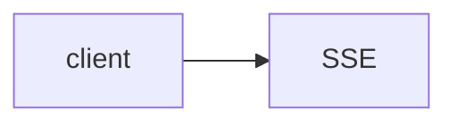

# Lab 1: SSE streaming API

After this lab a client received tokens over `text/event-stream`.

## Data
- Script: `lab1_sse_streaming_api.py`

## Information
FastAPI yields lines from the model stream.

## Knowledge
1. Start the server.
2. Hit the SSE route.
3. See tokens.

## Wisdom
Not WebSocket.

## The When and Why
- **When:** the UI needs incremental text.
- **Why:** stdout is not HTTP.

## How it works



## Data contract
`data: ...`

## Run

```bash
python education/10_the_front_door/lab1_sse_streaming_api.py
```

## What you should see
SSE lines then [DONE].

## What this becomes later
Lab 2 adds interrupt.

## Related
- **Chapter 01 stream:** the same NDJSON, different socket.

## Notes

