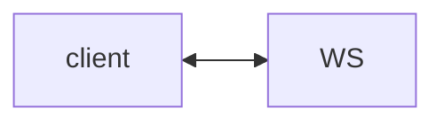

# Lab 2: WebSocket interrupt

After this lab a second message on the socket stops or pauses the run.

## Data
- Script: `lab2_websocket_interrupt.py`

## Information
One socket, tokens out, interrupt in.

## Knowledge
1. Connect.
2. Start a turn.
3. Send interrupt.
4. See the loop stop.

## Wisdom
Not SSE.

## The When and Why
- **When:** the user hits stop.
- **Why:** SSE is one-way.

## How it works



## Data contract
`{ "type": "interrupt" }`

## Run

```bash
python education/10_the_front_door/lab2_websocket_interrupt.py
```

## What you should see
Tokens, then a stop ack.

## What this becomes later
Chapter 09 HITL can use this socket.

## Related
- **Chapter 06 events:** same frames.

## Notes

