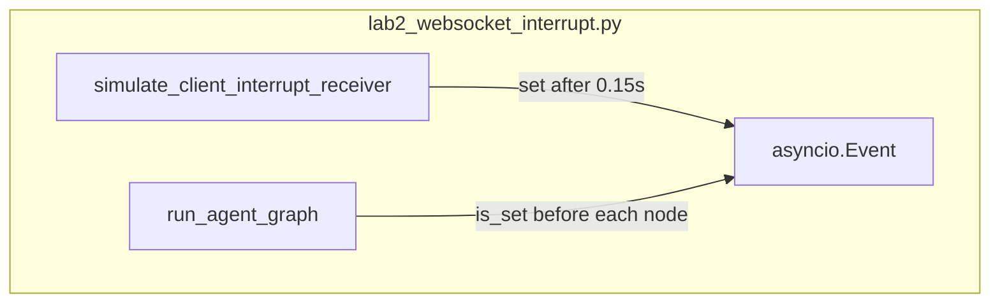

# Lab 2: WebSocket interrupt

A second inbound signal stopped the run at a node boundary.

## What you touch
- Script: `lab2_websocket_interrupt.py`
- Function: `run_agent_graph(interrupt_event)` where `interrupt_event` is `asyncio.Event`
- Nodes in order: `Node 1: Context Analysis`, `Node 2: Code Generation`, `Node 3: Security Verification`
- Before each node, `interrupt_event.is_set()`. If true, return `{ "status": "INTERRUPTED", "stopped_at_node", "completed_nodes" }`
- If all three finish: `{ "status": "COMPLETED", "completed_nodes": 3 }`
- Function: `simulate_client_interrupt_receiver(interrupt_event, delay_seconds)` sleeps, prints `INTERRUPT_TURN`, then `interrupt_event.set()`
- `__main__` scenario 1: no interrupt. Scenario 2: `delay_seconds=0.15` concurrent with the graph
- This script does not open a WebSocket and does not POST. It does not read `OLLAMA_HOST` or `OLLAMA_MODEL`.

## Steps


1. Write `run_agent_graph`. Loop the three node names. At the start of each iteration, if `interrupt_event.is_set()`, print the interrupt lines and return `INTERRUPTED` with `stopped_at_node` set to the node you have not started.
2. If the flag is clear, print `[NODE EXECUTION] Running {node_name}...` and `await asyncio.sleep(0.1)`.
3. Write `simulate_client_interrupt_receiver`. After `delay_seconds`, print `[WEBSOCKET CLIENT] Pushing Inbound Control Frame: 'INTERRUPT_TURN'` and call `interrupt_event.set()`.
4. Scenario 1: a fresh `asyncio.Event` that nobody sets. Expect `COMPLETED` and `completed_nodes` 3.
5. Scenario 2: `asyncio.create_task` on the graph and on the receiver with `delay_seconds=0.15`. `gather` both. Expect `INTERRUPTED` before `Node 3: Security Verification` and `completed_nodes` 2.
6. Do not start a WebSocket server. Do not use SSE for the inbound stop.

## Data contract
Intended inbound frame a real WebSocket should accept. The reference script uses an `asyncio.Event` (Notes).

**Intended inbound**

```json
{ "type": "interrupt" }
```

**Reference script return on stop**

```json
{
  "status": "INTERRUPTED",
  "stopped_at_node": "Node 3: Security Verification",
  "completed_nodes": 2
}
```

**Reference script return on a full run**

```json
{
  "status": "COMPLETED",
  "completed_nodes": 3
}
```

The simulated inbound print is the string `INTERRUPT_TURN`, not `{ "type": "interrupt" }`.

## Run
From the repo root:

```bash
python education/10_the_front_door/lab2_websocket_interrupt.py
```

```powershell
python education/10_the_front_door/lab2_websocket_interrupt.py
```

This script does not read `OLLAMA_HOST` or `OLLAMA_MODEL`. Do not set those vars for this lab.

## What you should see
`=== STARTING WEBSOCKET INTERACTIVE INTERRUPTION LAB ===`. Scenario 1 prints three `[NODE EXECUTION]` lines and `Result: {'status': 'COMPLETED', 'completed_nodes': 3}`. Scenario 2 prints `[WEBSOCKET CLIENT] Pushing Inbound Control Frame: 'INTERRUPT_TURN'`, then `[INTERRUPT HANDLER] [STOP] Interrupt Flag SET! Pausing graph execution at boundary before 'Node 3: Security Verification'.`, then `Status: AGENT_INTERRUPTED_AWAITING_USER_INPUT`, then `Result: {'status': 'INTERRUPTED', 'stopped_at_node': 'Node 3: Security Verification', 'completed_nodes': 2}`. If both scenarios print `COMPLETED`, the receiver task did not run or `is_set` was not checked.

## Stop here
Do not add FastAPI, `websockets`, or a browser. Do not send the interrupt over SSE. Next: [lab3_frontend_client.md](./lab3_frontend_client.md).

## Notes
- Keep the three node names, the 0.1s node sleep, and scenario 2 `delay_seconds=0.15`.
- Contract drift vs `lab2_websocket_interrupt.py`: no WebSocket server, no port, no JSON frame `{ "type": "interrupt" }`. The inbound signal is `asyncio.Event.set()` after a sleep. The print string is `INTERRUPT_TURN`. No POST to Ollama. The intended contract is a two-way socket that accepts `{ "type": "interrupt" }` and stops the loop. Write that in your copy. Do not edit the `.py` in the repo.
- Chapter 09 HITL can use this stop later. Chapter 06 events are the same idea on a queue.
