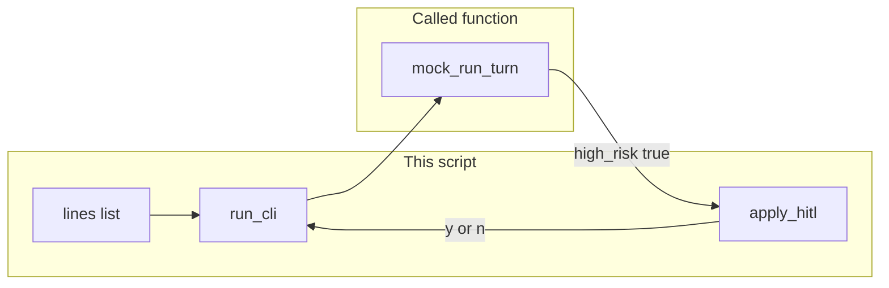

# Lab 5: CLI harness as a client

A stdin/stdout loop calls `run_turn`, prints `response`, and asks y/n on a high-risk line. The mock `run_turn` means the lab runs without a model. The CLI does not own the agent loop.

## What you touch
- Script: `lab5_cli_harness.py` (write it next to this brief; there is no reference `.py` yet)
- Function: `mock_run_turn(session_id, user_prompt)` returns a `run_turn` dict
- Function: `apply_hitl(turn, answer)` returns `{ "applied": bool, "tool": name }` when `high_risk` is true
- Function: `run_cli(lines, run_turn)` walks a list of strings (fake stdin) so the script does not hang on `input()`
- Session id: `cli-1`
- Fixture lines in `__main__`: `What is 2+2?`, `Write config.json`, `n`, then a second list `Write config.json`, `y`
- Print `response` only. Do not print `thinking` on the default path.
- No HTTP. This script does not read `OLLAMA_HOST` or `OLLAMA_MODEL`.
- Do not copy `CoreAgentKernel`. Do not start FastAPI. Do not build a TUI.

## Steps


1. Write `mock_run_turn(session_id, user_prompt)`. If the prompt contains `Write` or `write`, return `{ "session_id", "turn_count": 1, "thinking": "will write config", "response": "Apply write to config.json?", "high_risk": True, "tool": "write_file" }`. Else return `{ "session_id", "turn_count": 1, "thinking": "add the numbers", "response": "4", "high_risk": False }`.
2. Write `apply_hitl(turn, answer)`. If `turn["high_risk"]` is false, return `{ "applied": False, "reason": "not_high_risk" }`. If `answer.strip().lower()` is `y`, return `{ "applied": True, "tool": turn["tool"] }`. Else return `{ "applied": False, "tool": turn["tool"] }`.
3. Write `run_cli(lines, run_turn)`. `session_id` is `cli-1`. Walk the list with an index. Each user line is printed as `USER: ` plus the line. Call `run_turn(session_id, line)`. Print `ASSISTANT: ` plus `turn["response"]`. Do not print `thinking`.
4. If `turn["high_risk"]` is true, take the next list item as the y/n answer. Print `HITL: Apply write to config.json? [y/n]`. Print `USER: ` plus that answer. Call `apply_hitl`. If `applied` is true, print `APPLY: ` plus the tool name. If false, print `SKIP: ` plus the tool name. Do not call a write function.
5. In `__main__`, call `run_cli(["What is 2+2?", "Write config.json", "n"], mock_run_turn)`. Then call `run_cli(["Write config.json", "y"], mock_run_turn)`.
6. Confirm the first run prints `4` then `SKIP: write_file`. Confirm the second run prints `APPLY: write_file`. Do not POST. Do not import `CoreAgentKernel`.

## Data contract
Only the keys this script writes and reads.

**Safe `run_turn` return**

```json
{
  "session_id": "cli-1",
  "turn_count": 1,
  "thinking": "add the numbers",
  "response": "4",
  "high_risk": false
}
```

**High-risk `run_turn` return**

```json
{
  "session_id": "cli-1",
  "turn_count": 1,
  "thinking": "will write config",
  "response": "Apply write to config.json?",
  "high_risk": true,
  "tool": "write_file"
}
```

**HITL apply**

```json
{ "applied": true, "tool": "write_file" }
```

**HITL skip**

```json
{ "applied": false, "tool": "write_file" }
```

The CLI prints `response`. It does not print `thinking`. It does not write `state_store/{session_id}.json`. That file is chapter 07.

## Run
From the repo root:

```bash
python education/10_the_front_door/lab5_cli_harness.py
```

```powershell
$env:OLLAMA_HOST="http://192.168.1.29:11434"
$env:OLLAMA_MODEL="qwen3.6:35b-a3b-65k"
python education/10_the_front_door/lab5_cli_harness.py
```

This script ignores `OLLAMA_HOST` and `OLLAMA_MODEL`. They are listed so the lab Run block matches the other chapters. There is no HTTP call.

## What you should see
First `run_cli`: `USER: What is 2+2?` then `ASSISTANT: 4` then `USER: Write config.json` then `ASSISTANT: Apply write to config.json?` then `HITL: Apply write to config.json? [y/n]` then `USER: n` then `SKIP: write_file`. Second `run_cli`: `USER: Write config.json` then the HITL lines then `USER: y` then `APPLY: write_file`. If `thinking` prints, you dumped MX. If the script waits for a keyboard, you used `input()` instead of the list. If you see a POST or `CoreAgentKernel`, you copied the chapter 07 loop.

## Stop here
This is a client. Do not copy `CoreAgentKernel`. Do not write `state_store`. Do not start FastAPI. Do not build a TUI. Chapter 07 owns `run_turn` and the session file. Chapter 09 owns the HITL gate object. Lab 3 is the HTML client of the same loop.

## Notes
- Write `lab5_cli_harness.py` next to this brief. There is no reference `.py` in the repo yet.
- `run_cli` takes `run_turn` as an argument so a later copy can pass the real kernel. This lab uses `mock_run_turn`.
- Keys written and read match this brief. Do not edit other `.py` files in the repo.
