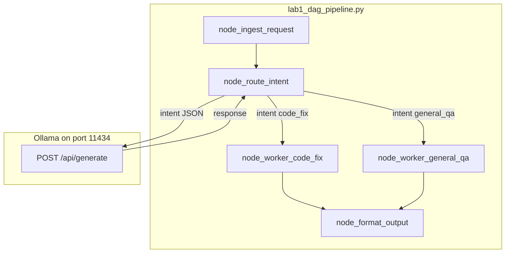

# 10: Deterministic DAGs: Fixed-Sequence Pipeline Execution

By the end of this chapter, you will build a deterministic Directed Acyclic Graph (DAG) pipeline where a shared state dictionary passes sequentially through named worker functions, using an LLM classifier node to route decisions dynamically.

In Chapter 04, we built freeform ReAct loops. In this chapter, we explore deterministic DAGs—where the execution order is fixed in code, and the model is called only when an intelligent routing decision is required.

## Data
A **DAG (Directed Acyclic Graph)** is a sequence of processing steps where data moves strictly forward without loops:
- **Pipeline State**: A dictionary initialized at ingestion and updated by each consecutive node:
  `{"raw_input": str, "timestamp": float, "status": "INGESTED", ...}`.
- **Node Functions**:
  1. `node_ingest_request`: Captures user input and timestamps the start of execution.
  2. `node_route_intent`: Queries the LLM (`POST /api/generate`) to classify the user request into a structured JSON intent (`code_fix` vs `general_qa`) with confidence scoring.
  3. `node_worker_code_fix` / `node_worker_general_qa`: Specialized worker functions that execute the appropriate task.
  4. `node_format_output`: Constructs the final structured completion payload.

## Information
In mission-critical enterprise systems, not every step should be autonomous or open-ended:
- **Deterministic Pipeline Structure**: Ingestion, validation, and final formatting always execute in a predictable order.
- **Targeted Intelligence**: The LLM is used precisely where natural language classification is needed, while the rest of the pipeline executes predictably in pure Python.

## Knowledge
Here is the step-by-step procedure:
1. Accept raw user input and initialize state in `node_ingest_request()`.
2. In `node_route_intent()`, prompt the model to return JSON with `intent` (`code_fix` or `general_qa`) and `confidence`.
3. Safely parse the response with fallback handling (`except Exception -> intent="general_qa"`).
4. Branch deterministically based on `state["intent"]` to invoke the corresponding worker function.
5. Package the result in `node_format_output()` and return the final payload.

## Wisdom
Use deterministic DAGs when process compliance, auditability, and predictable step execution are mandatory.

## The When and Why
- **When**: Use DAG pipelines when workflows follow a strict multi-stage lifecycle (e.g. Ingest $\rightarrow$ Triage $\rightarrow$ Process $\rightarrow$ Format).
- **Why**: Unrestricted loops can hallucinate or skip necessary compliance checks. DAGs enforce reliable execution order in code.

## How it works



Walkthrough of the lab prompt `Fix the syntax error on line 42 in main.py where a closing parenthesis is missing.`:

1. `node_ingest_request` stores that string in `raw_input` and sets `status` to `INGESTED`.
2. `node_route_intent` POSTs a classifier prompt. The model returns JSON. The script sets `intent` to `code_fix` (or falls back to `general_qa` if the JSON is bad).
3. Because `intent == "code_fix"`, `node_worker_code_fix` sets `worker_output` to a stub about a code patch. It does not open the file `main.py`.
4. `node_format_output` builds `final_payload` with `status: COMPLETED`, `processed_intent`, `result`, and elapsed seconds from `timestamp`.
5. `run_dag_pipeline` prints that payload.

Nothing in that walkthrough goes back to ingest. There is no second router call.

## Data contract

**Router request** `POST /api/generate`

```json
{
  "model": "llama3.2:1b",
  "prompt": "string",
  "stream": false,
  "options": { "temperature": 0.0 }
}
```

**Router reads** `response` (a JSON string, not a chat `message`).

**Router JSON** (parsed from `response`)

```json
{ "intent": "code_fix", "confidence": 0.98 }
```

`intent` is `code_fix` or `general_qa`.

**Final payload** (`state["final_payload"]`)

```json
{
  "status": "COMPLETED",
  "processed_intent": "code_fix",
  "result": "string",
  "pipeline_duration_seconds": 0
}
```

## Lab
Done when a code-fix prompt takes the `code_fix` branch and prints a completed payload.

- Module: [this file](./00_deterministic_dags.md)
- Lab 1: [lab1_dag_pipeline.py](./lab1_dag_pipeline.py) / [lab1_dag_pipeline.md](./lab1_dag_pipeline.md) - ingest, route, one worker, format. Done when `processed_intent` is `code_fix` and `status` is `COMPLETED`.
- Lab 2: [lab2_graph_workflow.md](./lab2_graph_workflow.md) - named edge and a back edge. Module: [01_graph_workflows.md](./01_graph_workflows.md).
- Lab 3: [lab3_async_event_queue.md](./lab3_async_event_queue.md) / [lab3_async_event_queue.py](./lab3_async_event_queue.py) - async 202 queue. Module: [02_event_driven.md](./02_event_driven.md).

## Related
- **Airflow / Prefect:** same topological run, heavier runtime.
- **Hardcoded if/else:** no model, under 1 ms. Use it when the branch is not ambiguous.
- **Chapter 04 ReAct:** the model picks the next tool. This page picks the next node in Python after one classifier POST.

## Notes
- If the model wraps JSON in fences, strip ` ```json ` before `json.loads`. On failure the lab falls back to `general_qa`.
- The workers are stubs. They do not call the model and they do not edit `main.py`.
- Route is `/api/generate`, not `/api/chat`. The classifier prompt is a single string.
