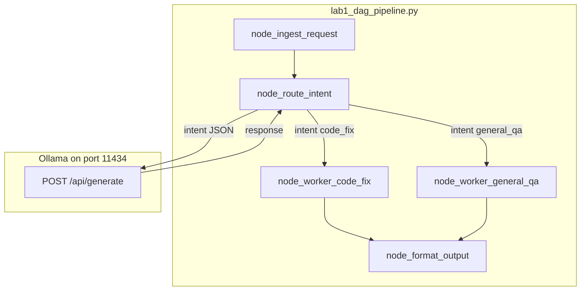

# 10: Deterministic DAGs

After this page you pass a dict through named functions in a fixed order. One node may call the model to pick a branch. That is a DAG. A back edge (test, then refactor, then test again) is the next page.

## Data
A **DAG** is a directed acyclic graph: named steps with arrows, and no arrow that goes back to an earlier step. In the lab the steps are Python functions. Each one takes a `state` dict and returns that same dict with more keys.

**State** starts in `node_ingest_request`. That function does not take a dict. It takes the raw user string and returns `{ "raw_input", "timestamp", "status": "INGESTED" }`. Every later node is `state = node(state)`.

**Nodes** in `lab1_dag_pipeline.py`:
- `node_ingest_request` (build the dict)
- `node_route_intent` (the only HTTP call)
- `node_worker_code_fix` or `node_worker_general_qa` (plain string stubs, no model)
- `node_format_output` (build `final_payload`)

The **router** POSTs to `{OLLAMA_HOST}/api/generate` (default host `http://127.0.0.1:11434`, model `llama3.2:1b`). It asks for a raw JSON object with `intent` (`code_fix` or `general_qa`) and `confidence` (0.0 to 1.0). It reads `response`, strips a leading ` ```json ` fence if present, then `json.loads`. On parse or HTTP error it sets `intent = "general_qa"` and `confidence = 0.0`.

`run_dag_pipeline` is the runner: ingest, route, `if state["intent"] == "code_fix"` else the QA worker, then format.

## Information
A ReAct loop (chapter 04) can skip or reorder steps because the model picks the next tool. A DAG cannot. The order is in Python: ingest, then route, then one worker, then format. Deterministic nodes do ingest and format. The model sits only at the ambiguous junction (which worker?).

The workers do not call Ollama. They set `worker_output` to a stub string. The point of this page is the fixed order and the one router POST, not a real code-repair model.

## Knowledge
1. Ingest the user string into a dict (`raw_input`, `timestamp`, `status`).
2. In the router node, POST `model`, `prompt`, `stream: false`, `options.temperature: 0.0` to `{OLLAMA_HOST}/api/generate`. Parse `response` as `{ "intent", "confidence" }`.
3. If parse or HTTP fails, set `intent` to `general_qa` and do not crash.
4. `if state["intent"] == "code_fix"` run `node_worker_code_fix`, else `node_worker_general_qa`.
5. Format `{ "status": "COMPLETED", "processed_intent", "result", "pipeline_duration_seconds" }` and print it.
6. Do not add a back edge or an event queue here.

## Wisdom
Use a DAG when the sequence must be audited: ingest always runs, format always runs, and you can name which worker ran. Use the chapter 04 loop when the next step is unknown. A graph with a retry loop is the next page. If you add that loop now, you will not know whether a skip came from the router or from a back edge.

## The When and Why
- **When:** the steps must happen in a fixed order (ingest, classify, process, format).
- **Why:** a free loop can skip a required step. A DAG names the order in code.

## How it works



Walkthrough of the lab prompt `Fix the syntax error on line 42 in main.py where a closing parenthesis is missing.`:

1. `node_ingest_request` stores that string in `raw_input` and sets `status` to `INGESTED`.
2. `node_route_intent` POSTs a classifier prompt. The model returns JSON. The script sets `intent` to `code_fix` (or falls back to `general_qa` if the JSON is bad).
3. Because `intent == "code_fix"`, `node_worker_code_fix` sets `worker_output` to a stub about a code patch. It does not open the file `main.py`.
4. `node_format_output` builds `final_payload` with `status: COMPLETED`, `processed_intent`, `result`, and elapsed seconds from `timestamp`.
5. `run_dag_pipeline` prints that payload.

Nothing in that walkthrough goes back to ingest. There is no second router call.

## Data contract

**Router request** `POST /api/generate`

```json
{
  "model": "llama3.2:1b",
  "prompt": "string",
  "stream": false,
  "options": { "temperature": 0.0 }
}
```

**Router reads** `response` (a JSON string, not a chat `message`).

**Router JSON** (parsed from `response`)

```json
{ "intent": "code_fix", "confidence": 0.98 }
```

`intent` is `code_fix` or `general_qa`.

**Final payload** (`state["final_payload"]`)

```json
{
  "status": "COMPLETED",
  "processed_intent": "code_fix",
  "result": "string",
  "pipeline_duration_seconds": 0
}
```

## Lab
Done when a code-fix prompt takes the `code_fix` branch and prints a completed payload.

- Module: [this file](./00_deterministic_dags.md)
- Lab 1: [lab1_dag_pipeline.py](./lab1_dag_pipeline.py) / [lab1_dag_pipeline.md](./lab1_dag_pipeline.md) - ingest, route, one worker, format. Done when `processed_intent` is `code_fix` and `status` is `COMPLETED`.
- Lab 2: [lab2_graph_workflow.md](./lab2_graph_workflow.md) - named edge and a back edge. Module: [01_graph_workflows.md](./01_graph_workflows.md).
- Lab 3: [lab3_async_event_queue.md](./lab3_async_event_queue.md) / [lab3_async_event_queue.py](./lab3_async_event_queue.py) - async 202 queue. Module: [02_event_driven.md](./02_event_driven.md).

## Related
- **Airflow / Prefect:** same topological run, heavier runtime.
- **Hardcoded if/else:** no model, under 1 ms. Use it when the branch is not ambiguous.
- **Chapter 04 ReAct:** the model picks the next tool. This page picks the next node in Python after one classifier POST.

## Notes
- If the model wraps JSON in fences, strip ` ```json ` before `json.loads`. On failure the lab falls back to `general_qa`.
- The workers are stubs. They do not call the model and they do not edit `main.py`.
- Route is `/api/generate`, not `/api/chat`. The classifier prompt is a single string.
