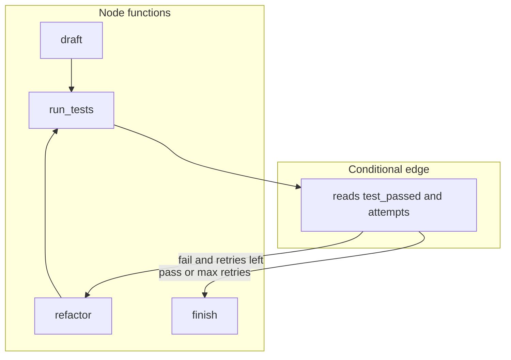

# 10: State Graph Workflows: Conditional Edges and Cyclic Execution Loops

By the end of this chapter, you will build state graph workflows featuring conditional edges and cyclic loops (such as drafting code, running tests, refactoring upon failure, and repeating until tests pass).

In the previous module, DAGs moved strictly forward. In this chapter, we add back edges—allowing workflows to retry, correct errors, and self-heal automatically.

## Data
A **State Graph** introduces cyclic transitions to workflow pipelines:
- **Shared State Dictionary**: Holds workflow attributes (e.g. `{"code": str, "attempts": int, "test_passed": bool}`).
- **Node Functions**: Python functions taking `state: dict -> dict` (such as `draft`, `run_tests`, and `refactor`).
- **Conditional Edge Functions**: Routing functions that evaluate state and return the next target node name (e.g. `edge_after_tests` returning `"refactor"` or `"finish"`).
- **Execution Budget (`max_retries`)**: A safeguard ceiling preventing infinite loop cycles if tests never pass.

## Information
In real-world software workflows, solutions often require multiple attempts and iterative refinement. 

State graphs model this natural development cycle:
- `draft` produces the initial attempt.
- `run_tests` checks correctness.
- The conditional edge inspects test results: if failed and attempts remain, it routes back to `refactor` and re-tests; once passed, it routes to `finish`.

## Knowledge
Here is the step-by-step procedure:
1. Define node functions that mutate and return state (`draft`, `run_tests`, `refactor`).
2. Write a conditional edge function `edge_after_tests(state, max_retries=3)`:
   - If `test_passed` is `False` and `attempts < max_retries`, return `"refactor"`.
   - Otherwise, return `"finish"`.
3. Implement `run_graph(state, max_retries=3)`:
   - Start at `"draft"`.
   - Follow edges dynamically until reaching `"finish"` or exhausting retry limits.
   - Print each node execution and transition decision.

## Wisdom
State graphs provide a clean, native Python structure for iterative self-correction without requiring complex external orchestration engines.

## The When and Why
- **When**: Use state graphs whenever an agent task requires iterative validation, testing, code generation, or self-correction.
- **Why**: Pure DAG pipelines cannot loop back upon errors without duplicating code. Conditional edges allow elegant, bounded retry loops.

## How it works



Walkthrough of lab 2 (same dict as chapter 07, no SQLite):

1. `draft` writes a one-line `calculate_total` into `code` and sets `test_passed` to false.
2. `run_tests` increments `attempts`. On attempt 1 it sets `test_passed` false.
3. `edge_after_tests` reads those keys and returns `"refactor"`.
4. `refactor` replaces `code` with a version that checks `price < 0`.
5. `run_tests` runs again. Attempt 2 sets `test_passed` true.
6. The edge returns `"finish"`. `run_graph` stops.

The new control is the string the edge returns. The dict is the same object the whole time.

## Data contract

**State dict**

```json
{ "code": "string", "attempts": 0, "test_passed": false }
```

**Edge return:** a string node name, for example `"refactor"` or `"finish"`. Not a URL. Not a JSON object.

**Node signature:** `def node(state: dict) -> dict`.

## Lab
Done when the runner prints each node name and the edge return, then stops on `"finish"`.

- Module: [this file](./01_graph_workflows.md)
- Lab 2: [lab2_graph_workflow.md](./lab2_graph_workflow.md) — write `lab2_graph_workflow.py`. Nodes `draft`, `run_tests`, `refactor`. `edge_after_tests` returns `"refactor"` or `"finish"`. Done when the print shows the cycle then `"finish"`.
- Previous page: [00_deterministic_dags.md](./00_deterministic_dags.md) / [lab1_dag_pipeline.md](./lab1_dag_pipeline.md) (no back edge).
- Chapter 07 checkpointer: [../07_the_state/lab2_state_checkpointer.py](../07_the_state/lab2_state_checkpointer.py) is this graph plus SQLite. This page is the edge, not the INSERT.

## Related
- **State graph workflows:** nodes, reducers, checkpointers as classes. Same dict plus edge names.
- **XState:** same finite-state job in JavaScript.
- **Chapter 07 checkpointer:** this loop with an INSERT after each node.

## Notes
- There is no reference `lab2_graph_workflow.py` yet. Write it from the brief.
- HITL interrupts and time-travel forks are later. Do not add them here.
