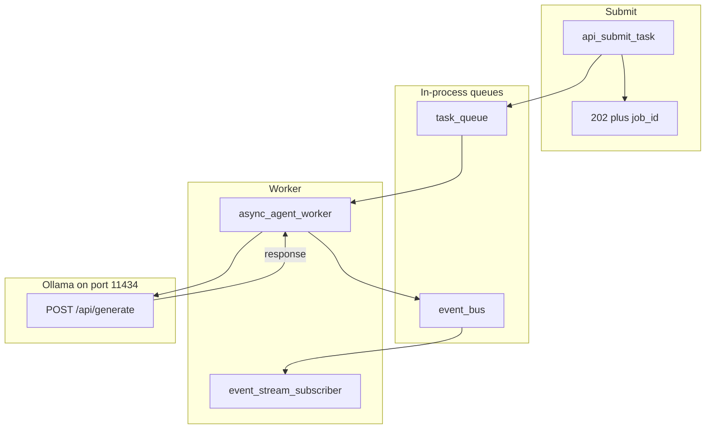

# 10: Event-driven workflows

After this page a submit function returns immediately (`status_code` 202 plus `job_id`) and a worker reads an `asyncio.Queue`. The long model call does not sit inside the submit. FastAPI and SSE are chapter 10.

## Data
The last two pages ran nodes in the same process and waited. This page splits **submit** from **work**.

`task_queue` is an `asyncio.Queue`. Submit puts `{ "job_id", "prompt" }`. The worker `get()`s that dict.

`event_bus` is a second `asyncio.Queue`. `emit_event(event_type, job_id, data)` puts a frame `{ "event_type", "job_id", "timestamp", "data" }`. Types in the lab: `job.started`, `agent.thought`, `agent.completed`, `agent.failed`.

`api_submit_task(prompt)` builds `job_id` as `job_{int(time.time() * 1000)}`, puts the job, and returns `{ "status_code": 202, "message": "Accepted", "job_id", "status_url": "/api/jobs/{job_id}" }`. There is no real HTTP server. The 202 is a dict. Chapter 10 puts that dict on a port.

The worker POSTs to `{OLLAMA_HOST}/api/generate` (default `http://192.168.1.29:11434`, model `qwen3.6:35b-a3b-65k`) inside `loop.run_in_executor` with `timeout=30`. It sends `model`, `prompt`, `stream: false`, `options.temperature: 0.0`. It reads `response`.

Functions in `lab3_async_event_queue.py`: `emit_event`, `async_agent_worker`, `event_stream_subscriber`, `api_submit_task`, `main`.

## Information
A synchronous HTTP handler waits for the model. Gateways often cut that wait at 30 to 60 seconds and return 504. Enqueue the job, return 202, let a worker POST to Ollama, emit events on the bus. The submit clock stops when the dict is returned, not when `response` arrives.

`urllib.request.urlopen` is blocking. The lab wraps it in `run_in_executor` so the asyncio loop can still run the subscriber while the POST is in flight.

The subscriber prints each frame. That print is a stand-in for SSE or a WebSocket. Chapter 10 is the real socket.

## Knowledge
1. Create `task_queue` and `event_bus` as `asyncio.Queue()`.
2. Start `async_agent_worker` and `event_stream_subscriber` with `asyncio.create_task`.
3. `api_submit_task` puts `{ job_id, prompt }` and returns 202 plus `job_id` plus `status_url`. Do not POST inside submit.
4. The worker `get()`s a job, emits `job.started`, emits `agent.thought`, then POSTs `/api/generate` in an executor. On success emit `agent.completed` with `result` and `status: SUCCESS`. On error emit `agent.failed`.
5. `await task_queue.join()` so main waits for the worker, not for submit.
6. Do not add FastAPI, Redis, or Kafka here.

## Wisdom
An in-process `asyncio.Queue` is enough to prove 202 plus events. Redis, Kafka, and Celery are the same contract on more machines. A real HTTP route is chapter 10. If you add a framework now, a late 202 could come from the queue or from the framework, and you will not know which.

## The When and Why
- **When:** a model call can exceed the HTTP timeout.
- **Why:** holding the request open starves other work and dies at the gateway. 202 frees the caller while the worker talks to Ollama.

## How it works



Walkthrough of the lab prompt `Explain async event queues.`:

1. `main` starts one worker task and one subscriber task.
2. `api_submit_task` puts a job and returns 202 in a few milliseconds. That is the line you time.
3. The worker takes the job, emits `job.started`, then `agent.thought`.
4. The worker POSTs a one-sentence prompt to `/api/generate` in an executor.
5. On success it emits `agent.completed` with the `response` text. The subscriber prints each frame as `[STREAM EVENT]`.
6. `task_queue.join()` returns. `main` cancels the two tasks.

Submit does not wait for step 4. That is the new fact.

## Data contract

**Submit return**

```json
{
  "status_code": 202,
  "message": "Accepted",
  "job_id": "job_1",
  "status_url": "/api/jobs/job_1"
}
```

**Job on `task_queue`**

```json
{ "job_id": "job_1", "prompt": "string" }
```

**Worker request** `POST /api/generate`

```json
{
  "model": "qwen3.6:35b-a3b-65k",
  "prompt": "string",
  "stream": false,
  "options": { "temperature": 0.0 }
}
```

**Event frame**

```json
{
  "event_type": "agent.completed",
  "job_id": "job_1",
  "timestamp": 0,
  "data": { "result": "string", "status": "SUCCESS" }
}
```

## Lab
Done when submit prints 202 in about 0 seconds and later events include `agent.completed`.

- Module: [this file](./02_event_driven.md)
- Lab 3: [lab3_async_event_queue.py](./lab3_async_event_queue.py) / [lab3_async_event_queue.md](./lab3_async_event_queue.md) — two queues, one worker, one subscriber. Done when the 202 line prints before `agent.completed`.

## Related
- **Celery / BullMQ:** same queue, other process.
- **Redis Pub/Sub:** same event bus, networked.
- **Chapter 10 FastAPI / SSE:** this 202 and these frames on a real port.

## Notes
- 202 is the point: the caller is free while the worker talks to Ollama.
- There is no listening HTTP server in this lab. `status_url` is a string for later.
- `urlopen` uses `timeout=30`. A hang still fails the job and emits `agent.failed`.
