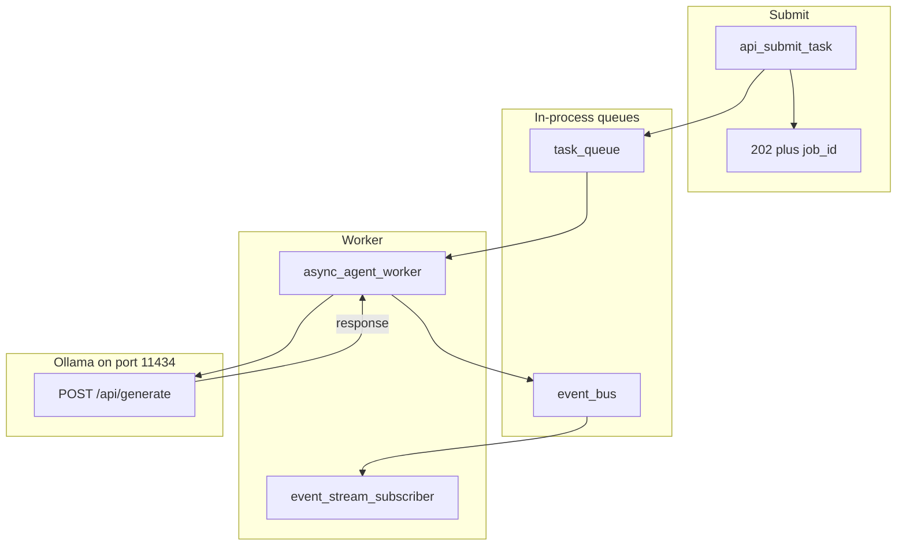

# 10: Event-Driven Workflows: Asynchronous Task Queues and Real-Time Event Streaming

By the end of this chapter, you will decouple task submission from execution by implementing an asynchronous task queue (`asyncio.Queue`) that returns an immediate HTTP 202 Accepted response and streams progress events (`job.started`, `agent.thought`, `agent.completed`) over an event bus.

In earlier modules, model calls were executed synchronously. In this chapter, we build non-blocking, event-driven architectures to prevent gateway timeouts and support real-time user interfaces.

## Data
An asynchronous event-driven workflow operates with two distinct queues:
1. **Task Queue (`task_queue`)**: An `asyncio.Queue` that buffers incoming execution requests:
   `{"job_id": "job_123", "prompt": "string"}`.
2. **Event Bus (`event_bus`)**: An `asyncio.Queue` that streams progress frames:
   `{"event_type": str, "job_id": str, "timestamp": float, "data": dict}`.
   Event types include: `job.started`, `agent.thought`, `agent.completed`, and `agent.failed`.
3. **Immediate Acknowledgement**: `api_submit_task(prompt)` generates a unique `job_id`, enqueues the job, and immediately returns:
   `{"status_code": 202, "message": "Accepted", "job_id": "...", "status_url": "/api/jobs/..."}`.

## Information
Synchronous HTTP handlers block until model inference finishes. If a complex agent task takes 30–60 seconds, browser gateways often drop connections with HTTP 504 Gateway Timeouts.

An event-driven pattern solves this:
- **Instant Response**: The client receives a 202 Accepted response in milliseconds.
- **Asynchronous Execution**: Background worker tasks process jobs from the queue at their own pace.
- **Real-Time Visibility**: The event bus streams thoughts and status updates to frontend subscribers without holding open synchronous blocking requests.

## Knowledge
Here is the step-by-step procedure:
1. Instantiate `task_queue` and `event_bus` as `asyncio.Queue()` instances.
2. Launch `async_agent_worker` and `event_stream_subscriber` as concurrent background tasks using `asyncio.create_task()`.
3. In `api_submit_task(prompt)`, push the job to `task_queue` and immediately return HTTP 202 metadata.
4. In the worker loop, pop jobs from `task_queue`, emit `job.started`, execute inference asynchronously via `loop.run_in_executor()`, and emit `agent.completed` with the result.
5. In the subscriber, read from `event_bus` and stream event frames to the user.

## Wisdom
Using Python's built-in `asyncio.Queue` allows you to test and validate event-driven patterns with zero external broker dependencies (like Redis or Kafka).

## The When and Why
- **When**: Use event queues whenever agent tasks take more than a few seconds, or when building streaming interactive UIs.
- **Why**: Synchronous blocking calls exhaust server connections and trigger timeout errors. Event-driven architectures ensure snappy APIs and real-time observability.

## How it works



Walkthrough of the lab prompt `Explain async event queues.`:

1. `main` starts one worker task and one subscriber task.
2. `api_submit_task` puts a job and returns 202 in a few milliseconds. That is the line you time.
3. The worker takes the job, emits `job.started`, then `agent.thought`.
4. The worker POSTs a one-sentence prompt to `/api/generate` in an executor.
5. On success it emits `agent.completed` with the `response` text. The subscriber prints each frame as `[STREAM EVENT]`.
6. `task_queue.join()` returns. `main` cancels the two tasks.

Submit does not wait for step 4. That is the new fact.

## Data contract

**Submit return**

```json
{
  "status_code": 202,
  "message": "Accepted",
  "job_id": "job_1",
  "status_url": "/api/jobs/job_1"
}
```

**Job on `task_queue`**

```json
{ "job_id": "job_1", "prompt": "string" }
```

**Worker request** `POST /api/generate`

```json
{
  "model": "qwen3.6:35b-a3b-65k",
  "prompt": "string",
  "stream": false,
  "options": { "temperature": 0.0 }
}
```

**Event frame**

```json
{
  "event_type": "agent.completed",
  "job_id": "job_1",
  "timestamp": 0,
  "data": { "result": "string", "status": "SUCCESS" }
}
```

## Lab
Done when submit prints 202 in about 0 seconds and later events include `agent.completed`.

- Module: [this file](./02_event_driven.md)
- Lab 3: [lab3_async_event_queue.py](./lab3_async_event_queue.py) / [lab3_async_event_queue.md](./lab3_async_event_queue.md) — two queues, one worker, one subscriber. Done when the 202 line prints before `agent.completed`.

## Related
- **Celery / BullMQ:** same queue, other process.
- **Redis Pub/Sub:** same event bus, networked.
- **Chapter 10 FastAPI / SSE:** this 202 and these frames on a real port.

## Notes
- 202 is the point: the caller is free while the worker talks to Ollama.
- There is no listening HTTP server in this lab. `status_url` is a string for later.
- `urlopen` uses `timeout=30`. A hang still fails the job and emits `agent.failed`.
