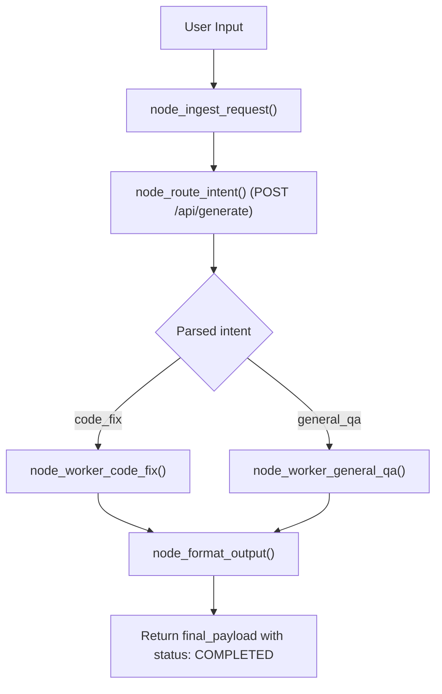

# Lab 1: Building a Deterministic DAG Pipeline with LLM Triage

In this lab, you will build a 4-stage Directed Acyclic Graph (DAG) pipeline that ingests user requests, uses an LLM router to classify user intent (`code_fix` vs `general_qa`), dispatches to the appropriate worker, and outputs a formatted payload with status `COMPLETED`.

---

## What you touch
- Script: `lab1_dag_pipeline.py`
- Node Functions:
  - `node_ingest_request(raw_user_input) -> dict`
  - `node_route_intent(state: dict) -> dict` (LLM triage)
  - `node_worker_code_fix(state: dict) -> dict` (code worker stub)
  - `node_worker_general_qa(state: dict) -> dict` (QA worker stub)
  - `node_format_output(state: dict) -> dict`
  - `run_dag_pipeline(raw_user_input: str) -> dict`
- URL / Endpoint: `{OLLAMA_HOST}/api/generate` (defaults to `http://127.0.0.1:11434/api/generate`)
- Test Prompt: `"Fix the syntax error on line 42 in main.py where a closing parenthesis is missing."`

---

## Steps


1. Read `OLLAMA_HOST` and `OLLAMA_MODEL` from environment variables, defaulting to `http://127.0.0.1:11434` and `llama3.2:1b`.
2. Implement `node_ingest_request(raw_user_input)`:
   - Return `{"raw_input": raw_user_input, "timestamp": time.time(), "status": "INGESTED"}`.
3. Implement `node_route_intent(state)`:
   - Prompt the model for a raw JSON classification: `{"intent": "code_fix" | "general_qa", "confidence": float}`.
   - Clean markdown code fences (` ```json `) and parse with `json.loads()`.
   - On exception, gracefully fall back to `{"intent": "general_qa", "confidence": 0.0}`.
4. Implement worker stubs (`node_worker_code_fix`, `node_worker_general_qa`) to populate `worker_output`.
5. Implement `node_format_output(state)`:
   - Construct `final_payload` with `status: "COMPLETED"`, `processed_intent`, `result`, and `pipeline_duration_seconds`.
6. Implement `run_dag_pipeline(raw_user_input)` to sequence stages and print the formatted payload.
7. Test with the line-42 syntax error prompt and verify that `processed_intent` routes to `code_fix`.

---

## Data contract

**Router Classification Output**

```json
{
  "intent": "code_fix",
  "confidence": 0.98
}
```

**Final Formatted Payload (`final_payload`)**

```json
{
  "status": "COMPLETED",
  "processed_intent": "code_fix",
  "result": "[CODE PATCH] Analyzed and generated automated fix for: Fix the syntax error on line 42...",
  "pipeline_duration_seconds": 0.45
}
```

---

## Run
From the repository root, run:

```bash
python education/10_the_workflow/lab1_dag_pipeline.py
```

```powershell
python education/10_the_workflow/lab1_dag_pipeline.py
```

---

## What you should see
- `[NODE 1: INGESTION]` initializing pipeline state.
- `[NODE 2: LLM ROUTER]` classifying prompt as `code_fix`.
- `[NODE 3A: CODE WORKER]` processing the code patch stub.
- `[NODE 4: FORMATTER]` assembling final telemetry and printing the completed JSON payload.

---

## Stop here
You have successfully built a deterministic DAG with LLM triage! In Lab 2, we will create state graphs with cyclic back edges.

Next up: [Lab 2: Graph Workflows](./lab2_graph_workflow.md).

---

## Notes
*(Record your DAG pipeline execution logs here)*

