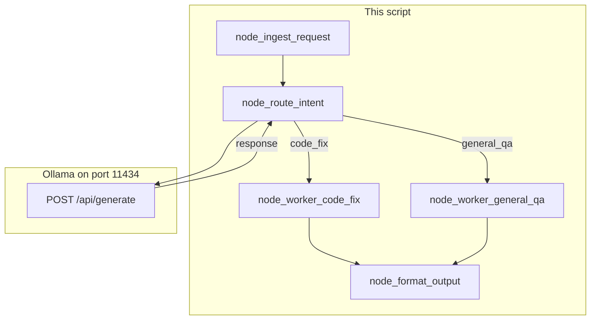

# Lab 1: DAG pipeline

A dict has gone ingest, router, one worker, format, and the printed payload has `status` `COMPLETED` and a `processed_intent`.

## What you touch
- Script: `lab1_dag_pipeline.py`
- Functions: `node_ingest_request`, `node_route_intent`, `node_worker_code_fix`, `node_worker_general_qa`, `node_format_output`, `run_dag_pipeline`
- URL / path: `{OLLAMA_HOST}/api/generate` (default `http://127.0.0.1:11434/api/generate`)
- Keys sent (router only): `model`, `prompt`, `stream` (`false`), `options.temperature` (`0.0`)
- Keys read: `response` (then `json.loads` for `intent` and `confidence`)
- State keys: `raw_input`, `timestamp`, `status`, `intent`, `confidence`, `worker_output`, `final_payload`
- Prompt in `__main__`: `Fix the syntax error on line 42 in main.py where a closing parenthesis is missing.`

## Steps


1. Read `OLLAMA_HOST` and `OLLAMA_MODEL` from the environment. If they are unset, use `http://127.0.0.1:11434` and `llama3.2:1b`. The route is `{host}/api/generate`.
2. Write `node_ingest_request(raw_user_input)`. Return `{ "raw_input": raw_user_input, "timestamp": time.time(), "status": "INGESTED" }`.
3. Write `node_route_intent(state)`. POST a classifier prompt that asks for raw JSON `{ "intent": "code_fix" or "general_qa", "confidence": 0.0 to 1.0 }`. Send `model`, `prompt`, `stream: false`, `options.temperature: 0.0`.
4. Read `data["response"]`. If the text starts with a markdown json fence, strip the fence. `json.loads` the text. Set `state["intent"]` and `state["confidence"]`. On any exception, set `intent` to `general_qa` and `confidence` to `0.0`.
5. Write the two workers. Each sets `state["worker_output"]` to a stub string that includes `state["raw_input"]`. Do not POST. Do not open `main.py`.
6. Write `node_format_output`. Set `state["final_payload"]` to `{ "status": "COMPLETED", "processed_intent": state["intent"], "result": state["worker_output"], "pipeline_duration_seconds": round(time.time() - state["timestamp"], 2) }`.
7. Write `run_dag_pipeline`. Call ingest, route, then `if state["intent"] == "code_fix"` the code worker else the QA worker, then format. Print `json.dumps(state["final_payload"], indent=2)`.
8. In `__main__`, call `run_dag_pipeline` with the line-42 prompt. If the host is unreachable, the router fallback should still print a completed payload with `general_qa`.

## Data contract
Only the keys this script sends and reads.

**Router request** `POST /api/generate`

```json
{
  "model": "llama3.2:1b",
  "prompt": "string",
  "stream": false,
  "options": { "temperature": 0.0 }
}
```

**Router reads** `response`.

**Parsed from `response`**

```json
{ "intent": "code_fix", "confidence": 0.98 }
```

**Printed `final_payload`**

```json
{
  "status": "COMPLETED",
  "processed_intent": "code_fix",
  "result": "string",
  "pipeline_duration_seconds": 0
}
```

## Run
From the repo root:

```bash
OLLAMA_HOST=http://127.0.0.1:11434 OLLAMA_MODEL=llama3.2:1b python education/10_the_workflow/lab1_dag_pipeline.py
```

```powershell
$env:OLLAMA_HOST="http://127.0.0.1:11434"
$env:OLLAMA_MODEL="llama3.2:1b"
python education/10_the_workflow/lab1_dag_pipeline.py
```

## What you should see
`[NODE 1: INGESTION]`, then `[NODE 2: LLM ROUTER]` with `code_fix` and a confidence, then `[NODE 3A: CODE WORKER]`, then `[NODE 4: FORMATTER]`, then a JSON payload with `status: COMPLETED` and `processed_intent: code_fix`. If the model wraps JSON in fences, the strip in step 4 still parses. If parse or HTTP fails, you see `[NODE 2: FALLBACK CASCADE]` and `processed_intent` is `general_qa` with `[NODE 3B: QA WORKER]`. If you see `URLError` and no fallback, the `except` is missing.

## Stop here
This is not ReAct. Do not let the model pick the next node. Do not add a back edge. Do not add a queue. The workers stay stubs. Next: [lab2_graph_workflow.md](./lab2_graph_workflow.md) or [01_graph_workflows.md](./01_graph_workflows.md).

## Notes
- Boundary: `parsed = json.loads(raw_text)` then `intent = parsed.get("intent", "general_qa")`. Exceptions fall back.
- Route is `/api/generate`, not `/api/chat`.
- Keys sent and read match this brief. Do not edit the `.py` in the repo.
- Chapter 08 uses a similar branch between two agents.
