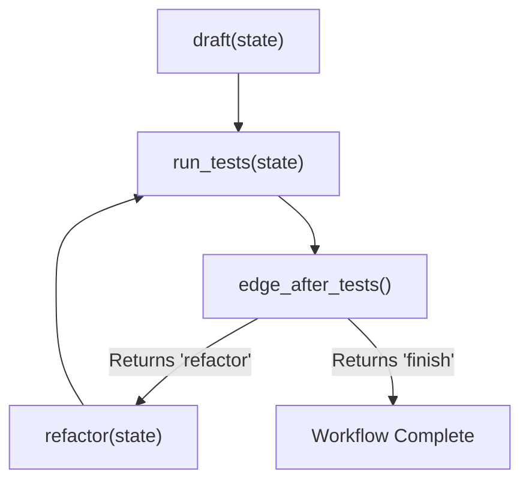

# Lab 2: Building a State Graph with Conditional Back Edges

In this lab, you will implement a state graph workflow runner `run_graph()` with conditional routing (`edge_after_tests()`) that loops between drafting, testing, and refactoring until tests pass or the retry budget is exhausted.

---

## What you touch
- Script to create: `lab2_graph_workflow.py`
- Node Functions: `draft(state)`, `run_tests(state)`, `refactor(state)` (each `dict -> dict`)
- Conditional Edge: `edge_after_tests(state, max_retries=3) -> str` (returns `"refactor"` or `"finish"`)
- Graph Runner: `run_graph(state, max_retries=3)`
- Shared State Keys: `code` (str), `attempts` (int), `test_passed` (bool)
- Pure Python logic (no network requests or database setup required)

---

## Steps


1. Initialize `state = {"code": "", "attempts": 0, "test_passed": False}`.
2. Implement `draft(state)`:
   - Set `code` to `"def calculate_total(price, tax): return price + tax"`.
   - Set `test_passed = False` and return `state`.
3. Implement `run_tests(state)`:
   - Increment `attempts += 1`.
   - On attempt 1, set `test_passed = False`. On attempt 2+, set `test_passed = True`.
   - Return `state`.
4. Implement `refactor(state)`:
   - Update `code` to include input validation:
     `"def calculate_total(price, tax):\n    if price < 0:\n        raise ValueError('Price cannot be negative')\n    return price + tax"`.
   - Return `state`.
5. Implement `edge_after_tests(state, max_retries=3) -> str`:
   - If `not state["test_passed"]` and `state["attempts"] < max_retries`, return `"refactor"`.
   - Otherwise, return `"finish"`.
6. Implement `run_graph(state, max_retries=3)`:
   - Maintain node lookup registry: `{"draft": draft, "run_tests": run_tests, "refactor": refactor}`.
   - Execute `"draft"`, then loop through `"run_tests"` and evaluate `edge_after_tests`.
   - Print each node invocation and edge decision.
7. In `__main__`, call `run_graph(state)` and verify the full retry-and-repair trace.

---

## Data contract

**State Structure**

```json
{
  "code": "def calculate_total(price, tax):\n    if price < 0:\n        raise ValueError('Price cannot be negative')\n    return price + tax",
  "attempts": 2,
  "test_passed": true
}
```

**Edge Routing Values**

```text
"refactor" | "finish"
```

---

## Run
From the repository root, run:

```bash
python education/10_the_workflow/lab2_graph_workflow.py
```

```powershell
python education/10_the_workflow/lab2_graph_workflow.py
```

---

## What you should see
- Execution trace showing:
  1. `[NODE: draft]`
  2. `[NODE: run_tests] (Attempt 1 - FAIL)`
  3. `[EDGE: edge_after_tests -> 'refactor']`
  4. `[NODE: refactor]`
  5. `[NODE: run_tests] (Attempt 2 - PASS)`
  6. `[EDGE: edge_after_tests -> 'finish']`
- Final state with `test_passed: true` and `attempts: 2`.

---

## Stop here
You have successfully implemented a state graph with cyclic back edges! In Lab 3, we will build an asynchronous event-driven task queue.

Next up: [Lab 3: Async Event Queue](./lab3_async_event_queue.md).

---

## Notes
*(Record your state graph transition logs here)*

