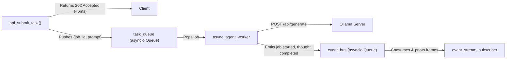

# Lab 3: Decoupling Execution with Asynchronous Event Queues

In this lab, you will decouple client request handling from model execution by implementing an asynchronous task queue (`task_queue`) and event streaming bus (`event_bus`), returning an immediate HTTP 202 Accepted response upon submission.

---

## What you touch
- Script: `lab3_async_event_queue.py`
- Main Components:
  - `task_queue` & `event_bus` (`asyncio.Queue` instances)
  - `api_submit_task(prompt) -> dict` (fast HTTP 202 producer)
  - `async_agent_worker(worker_id)` (background consumer running inference via `loop.run_in_executor`)
  - `event_stream_subscriber()` (event listener printing progress frames)
  - `emit_event(event_type, job_id, data)`
- URL / Endpoint: `{OLLAMA_HOST}/api/generate` (defaults to `http://127.0.0.1:11434/api/generate`)
- Event Lifecycle: `job.started`, `agent.thought`, `agent.completed`, `agent.failed`

---

## Steps


1. Read `OLLAMA_HOST` and `OLLAMA_MODEL` from environment variables, defaulting to `http://127.0.0.1:11434` and `llama3.2:1b`.
2. Initialize `task_queue = asyncio.Queue()` and `event_bus = asyncio.Queue()`.
3. Implement `emit_event(event_type: str, job_id: str, data: dict)` to push event records onto `event_bus`.
4. Implement `api_submit_task(prompt: str) -> dict`:
   - Generate `job_id = f"job_{int(time.time() * 1000)}"`.
   - Push `{"job_id": job_id, "prompt": prompt}` onto `task_queue`.
   - Immediately return `{"status_code": 202, "message": "Accepted", "job_id": job_id, "status_url": f"/api/jobs/{job_id}"}`.
5. Implement `async_agent_worker(worker_id)`:
   - Continuously consume jobs from `task_queue`.
   - Emit `job.started` and `agent.thought`.
   - Execute model inference non-blockingly using `loop.run_in_executor()`.
   - Emit `agent.completed` upon success (or `agent.failed` on exception) and call `task_queue.task_done()`.
6. Implement `event_stream_subscriber()` to print `[STREAM EVENT]` log frames in real time.
7. In `main()`:
   - Launch worker and subscriber background tasks with `asyncio.create_task()`.
   - Submit `"Explain async event queues."` and record submission latency.
   - Wait for queue completion with `await task_queue.join()` and cancel background tasks.

---

## Data contract

**Immediate Submission Response (202 Accepted)**

```json
{
  "status_code": 202,
  "message": "Accepted",
  "job_id": "job_1700000000000",
  "status_url": "/api/jobs/job_1700000000000"
}
```

**Streamed Event Frame**

```json
{
  "event_type": "agent.completed",
  "job_id": "job_1700000000000",
  "timestamp": 1700000001.25,
  "data": {
    "result": "Async event queues decouple submission from processing...",
    "status": "SUCCESS"
  }
}
```

---

## Run
From the repository root, run:

```bash
python education/10_the_workflow/lab3_async_event_queue.py
```

```powershell
python education/10_the_workflow/lab3_async_event_queue.py
```

---

## What you should see
1. `[CLIENT] Received HTTP 202 response in 0.00xxs!` confirming near-instant submission.
2. Real-time stream events printed chronologically:
   - `[STREAM EVENT] job.started`
   - `[STREAM EVENT] agent.thought`
   - `[STREAM EVENT] agent.completed` with the generated response.

---

## Stop here
You have successfully implemented an asynchronous event-driven workflow! In Chapter 11, we will explore planning, task decomposition, and self-reflection loops.

Next up: [Chapter 11: Planning and Reflection](../11_planning_and_reflection/00_planning_and_reflection.md).

---

## Notes
*(Record your asynchronous event stream trace here)*

