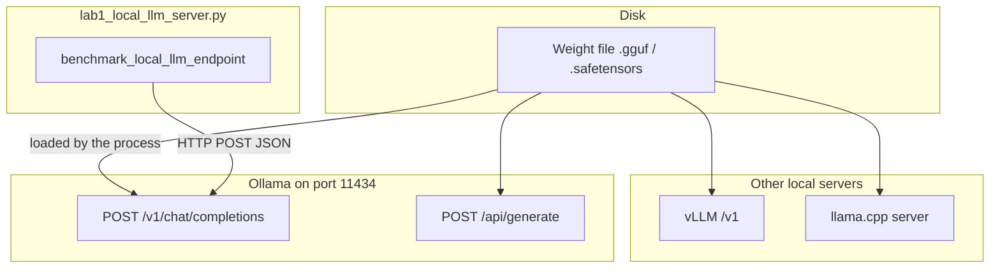

# 11: Local servers

After this page you can point at Ollama, vLLM, and llama.cpp as three processes that speak HTTP. The lab is `lab1_local_llm_server.py`.

## Data
A **local server** is a provider process on your LAN. It loads a weight file and accepts HTTP. Chapter 00 named the three things (script, provider, weights). This page compares three providers.

**Ollama** listens on port `11434` on this workspace at `192.168.1.29`. Native route: `POST /api/generate`. OpenAI-style route: `POST /v1/chat/completions`. The lab uses the OpenAI-style route.

**vLLM** is a server for higher throughput. It speaks OpenAI `/v1`. Use it when many requests share one GPU.

**llama.cpp server** is a C++ HTTP process in front of a GGUF file. Same job, thinner stack.

Private RAG (retrieve-then-generate over your files) is chapter 13. This page does not build a retriever.

The lab function is `benchmark_local_llm_endpoint(prompt)`. Host and model in the file are literals: `http://192.168.1.29:11434/v1/chat/completions` and `qwen3.6:35b-a3b-65k`. Intended env defaults are still `OLLAMA_HOST` `http://192.168.1.29:11434` and `OLLAMA_MODEL` `qwen3.6:35b-a3b-65k`.

## Information
The script talks to the process, not the weight file. If Ollama is down, you get a connection error. If the model name is wrong, you get an HTTP error (often 404). Those are two different failures.

The three servers accept JSON and return JSON. The keys differ. `/api/generate` uses `prompt` and `response`. `/v1/chat/completions` uses `messages` and `choices[0].message.content`.

## Knowledge
1. Name the process and the port. On this workspace that is Ollama at `192.168.1.29:11434`.
2. POST `/api/generate` or `/v1/chat/completions`. The lab POSTs `/v1/chat/completions` with `model`, `messages`, `temperature: 0.0`, `stream: false`.
3. Read the text field. On `/v1` that is `choices[0].message.content`. The lab also reads `usage.prompt_tokens` and `usage.completion_tokens` and prints TPS.
4. Do not open the `.gguf` or `.safetensors` file from Python.
5. Do not add a retriever or a second host.

## Wisdom
Pick Ollama for labs. Pick vLLM when many requests share a GPU. Do not start vLLM or llama.cpp in this lab. If you add them now, a failed POST could come from the wrong process.

## The When and Why
- **When:** you run weights on your LAN.
- **Why:** the server is not the weight file. The script only sees HTTP.

## How it works



Walkthrough of one run of the reference script:

1. `main` calls `benchmark_local_llm_endpoint` with `Explain why local-first LLM inference is critical for agent privacy and latency.`
2. The function POSTs to `http://192.168.1.29:11434/v1/chat/completions` with a `system` message and a `user` message.
3. Ollama runs the loaded weights and returns `choices[0].message.content` plus `usage`.
4. The function prints latency, `prompt_tokens`, `completion_tokens`, and TPS, then returns `{ model, response, total_latency_sec, prompt_tokens, completion_tokens, tps }`.
5. `main` prints `result["response"]`.

Nothing in that walkthrough opens the weight file. vLLM and llama.cpp are the same HTTP job on other ports.

## Data contract

**Intended** (chapter 00 generate):

**Request** `POST /api/generate`

```json
{
  "model": "qwen3.6:35b-a3b-65k",
  "prompt": "string",
  "stream": false
}
```

**Response**

```json
{
  "model": "qwen3.6:35b-a3b-65k",
  "response": "string",
  "done": true
}
```

**What the reference script actually sends** `POST /v1/chat/completions`

```json
{
  "model": "qwen3.6:35b-a3b-65k",
  "messages": [
    { "role": "system", "content": "string" },
    { "role": "user", "content": "string" }
  ],
  "temperature": 0.0,
  "stream": false
}
```

It reads `choices[0].message.content` and `usage`. See Notes.

## Lab
Done when you have named the process and one POST has printed model text.

- Module: [this file](./00_local_servers.md)
- Lab 1: [lab1_local_llm_server.py](./lab1_local_llm_server.py) / [lab1_local_llm_server.md](./lab1_local_llm_server.md) — POST `/v1/chat/completions`, print `response` and TPS. Done when you see two sentences from the model.
- Lab 2 picks a model id. Lab 3 retries a failed POST.

## Related
- **LM Studio:** GUI, same HTTP job.
- **vLLM:** OpenAI `/v1`, higher throughput. Not in the lab.
- **llama.cpp server:** GGUF plus HTTP. Not in the lab.
- **Chapter 00:** the three things. This page compares servers.
- **Chapter 13:** private RAG. Not this page.

## Notes
- Keep the existing ideas: Ollama on `:11434`, vLLM on `/v1`, llama.cpp as GGUF plus HTTP. Private RAG stays in chapter 13.
- Contract drift vs `lab1_local_llm_server.py`: host and model are literals, not `OLLAMA_HOST` / `OLLAMA_MODEL`. Route is `/v1/chat/completions`, not `/api/generate`. Extra keys: `temperature`, system message, `usage`, TPS. The intended contract is the chapter 00 generate POST. Write that in your copy. Leave the reference file as-is.
- Moved from modules/07/00.
