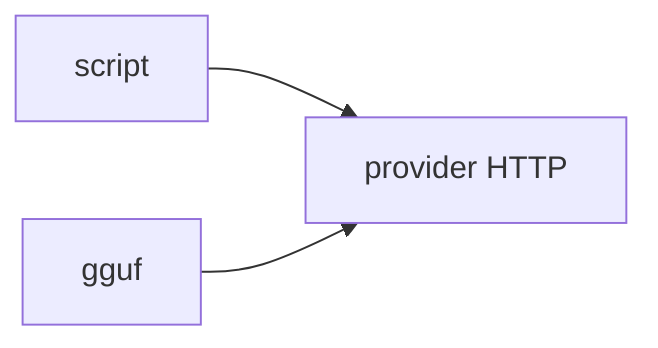

# 11: Local servers

After this page you can point at Ollama, vLLM, and llama.cpp as three processes that speak HTTP.

## Data
- Ollama: `:11434`
- vLLM: OpenAI `/v1`
- llama.cpp server: GGUF + HTTP
- Private RAG is chapter 13

## Information
Same three boxes as chapter 00. This chapter compares servers.

## Knowledge
1. Name the process and port.
2. Hit `/api/generate` or `/v1/chat/completions`.
3. Do not open the weight file from Python.

## Wisdom
Pick Ollama for labs. Pick vLLM when many requests share a GPU.

## The When and Why
- **When:** you run weights on your LAN.
- **Why:** the server is not the weight file.

## How it works

## Data contract
Same generate contract as chapter 00.

## Lab
- [lab1_local_llm_server.py](./lab1_local_llm_server.py) / [lab1_local_llm_server.md](./lab1_local_llm_server.md)

## Related
- **LM Studio:** GUI, same HTTP job.

## Notes
Moved from modules/07/00. Dropped private-data page to chapter 13.
