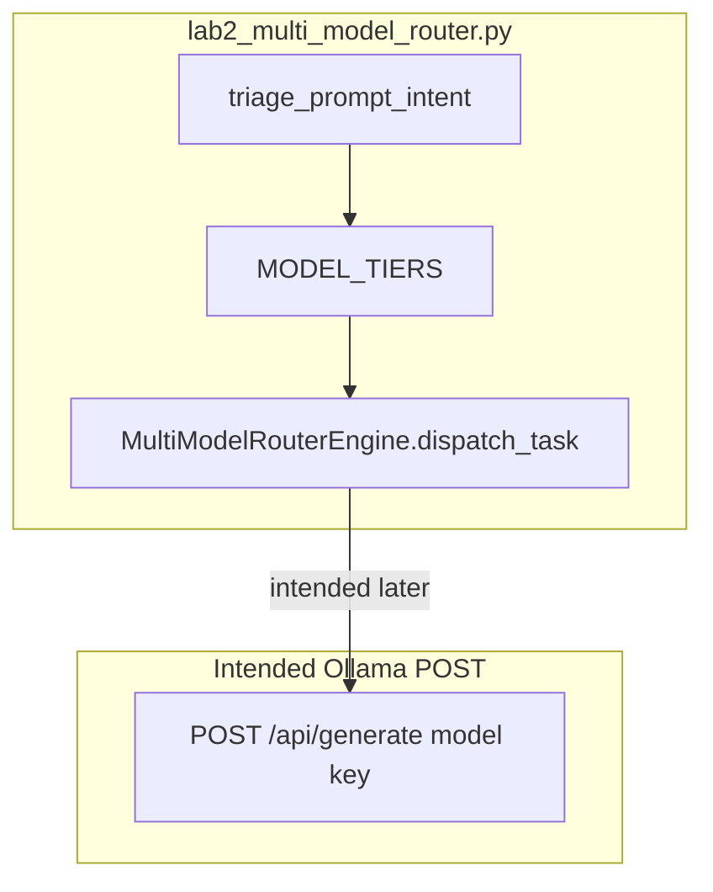

# 11: Multi-model router

After this page a string rule picks a model name before the POST. The lab is `lab2_multi_model_router.py`.

## Data
A **router** here is a dict or an if/else that maps intent to a model id. Intent is a short label for the job (`sql_query`, `code_refactor`). The model id is the string you put in the JSON `model` key.

One host can load more than one model name. The host on this workspace is Ollama at `192.168.1.29:11434`. The rule runs in your script before the POST.

The lab file is `lab2_multi_model_router.py`. The function is `triage_prompt_intent(prompt)`. It returns `FAST_TIER` or `DEEP_TIER`. The dict is `MODEL_TIERS`:

- `FAST_TIER`: display name `Fast SLM (7B)`, `latency_ms` 150, intents `sql_query` and `json_extract`.
- `DEEP_TIER`: display name `Deep LLM (35B/70B)`, `latency_ms` 1200, intents `code_refactor` and `system_architecture`.

Class `MultiModelRouterEngine` has `dispatch_task(prompt, force_schema_error=False)`. The lab does not POST. Intended env defaults are still `OLLAMA_HOST` `http://192.168.1.29:11434` and `OLLAMA_MODEL` `qwen3.6:35b-a3b-65k`.

## Information
Tasks need different sizes. A short SQL extract can use a small model. A design question can use a larger one. One model for everything wastes time or quality.

The rule is a keyword check, not a learned classifier. `triage_prompt_intent` looks for `architecture`, `refactor`, `design pattern`, `multi-step` (deep) or `select`, `sql`, `json`, `extract`, `parse` (fast). Anything else is `FAST_TIER`.

## Knowledge
1. Classify the prompt with a keyword (or a small if/else).
2. Set `model` (or a tier that maps to a model id).
3. POST `{ "model": "string", "prompt": "string" }` to the host. The reference script skips the POST and returns a simulated dict.
4. Print which model or tier ran.
5. Do not build a gateway mesh, OpenRouter, or LiteLLM.

## Wisdom
A keyword rule is enough to prove two prompts can use two ids. A fallback cascade (lab 2 scenario 3) is extra. Lab 3 is retries. If you add a mesh now, a wrong model could come from the rule or from the host list.

## The When and Why
- **When:** tasks need different sizes.
- **Why:** one model for everything wastes time or quality.

## How it works



Walkthrough of the three scenarios in `__main__`:

1. `Extract SQL SELECT query for active users` contains `sql` and `select`. `triage_prompt_intent` returns `FAST_TIER`. `dispatch_task` returns `tier_used` `FAST_TIER`, `model_name` `Fast SLM (7B)`, `fallback_occurred` false.
2. `Design a micro-services system architecture for real-time video streaming` contains `architecture`. Route is `DEEP_TIER`, `model_name` `Deep LLM (35B/70B)`.
3. `Extract SQL query for order history` with `force_schema_error=True` starts on `FAST_TIER`, raises `ValueError` (`Missing required key 'query_plan'`), then retries on `DEEP_TIER` with an enriched prompt. `fallback_occurred` is true.

Nothing in that walkthrough opens a socket. The new fact is the rule that picks a name.

## Data contract

**Intended POST body**

```json
{
  "model": "qwen3.6:35b-a3b-65k",
  "prompt": "string"
}
```

The `model` string is what the router chose.

**What `dispatch_task` actually returns**

```json
{
  "status": "SUCCESS",
  "tier_used": "FAST_TIER",
  "model_name": "Fast SLM (7B)",
  "simulated_latency_ms": 150,
  "fallback_occurred": false
}
```

There is no HTTP body. See Notes.

## Lab
Done when two prompts printed two different tier or model names.

- Module: [this file](./01_multi_model_router.md)
- Lab 2: [lab2_multi_model_router.py](./lab2_multi_model_router.py) / [lab2_multi_model_router.md](./lab2_multi_model_router.md) — keyword rule, three scenarios. Done when you see `FAST_TIER`, `DEEP_TIER`, and one fallback.
- Lab 3 retries a failed POST. Not this page.

## Related
- **OpenRouter / LiteLLM:** hosted version of this if. Not in the lab.
- **Chapter 06 router node:** intent JSON, one model. This page changes the model id.
- **00_local_servers.md:** the host the POST would hit.

## Notes
- Keep the existing ideas: dict or if/else on intent to a model id. Keyword rule, not a learned router. Not a full gateway mesh.
- Contract drift vs `lab2_multi_model_router.py`: no POST, no `OLLAMA_HOST` / `OLLAMA_MODEL`, no Ollama model id on the wire. Names are `FAST_TIER` / `DEEP_TIER` display strings. Extra fallback cascade on `ValueError` (closer to lab 3). `_execute_tier` sleeps 0.05s and returns a dict. The intended contract is set `model` then POST. Write that in your copy. Leave the reference file as-is.
- Moved from modules/07/01.
