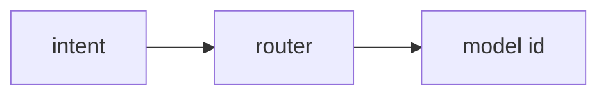

# 11: Multi-model router

After this page a string rule picks a model name before the POST.

## Data
- Router: dict or if/else on intent → model id
- Lab: `lab2_multi_model_router`

## Information
One host, more than one model name.

## Knowledge
1. Classify or use a keyword.
2. Set `model`.
3. POST.

## Wisdom
Not a full gateway mesh.

## The When and Why
- **When:** tasks need different sizes.
- **Why:** one model for everything wastes time or quality.

## How it works

## Data contract
`{ "model": "string", "prompt": "string" }`

## Lab
- [lab2_multi_model_router.py](./lab2_multi_model_router.py) / [lab2_multi_model_router.md](./lab2_multi_model_router.md)

## Related
- **OpenRouter / LiteLLM:** hosted version of this if.

## Notes
Moved from modules/07/01.
