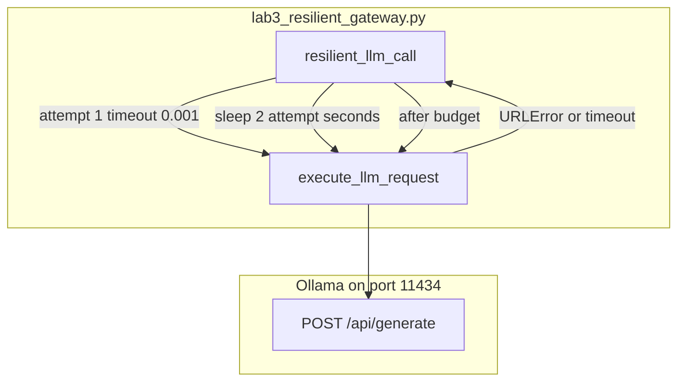

# 11: Resilient gateway

After this page a failed POST retries with backoff. A second host is optional. The lab is `lab3_resilient_gateway.py`.

## Data
A **gateway** here is a function around one POST. Chapter 01 had one try. This page wraps that try.

**Backoff** is a sleep that grows after each fail. The lab uses `2 ** attempt` seconds (`attempt` starts at 1, so 2s then stop). **Jitter** is a random extra delay so two clients do not retry on the same tick. The lab does not add jitter.

**Retry budget** is `max_retries`. The lab default is `2`.

Errors this page cares about: HTTP 429 (too many requests), HTTP 5xx (server error), and a connection drop (`URLError`). The lab forces a fail with `timeout_seconds=0.001` on attempt 1, then catches `URLError`, `TimeoutError`, and `Exception`.

A **circuit breaker** is a flag that stops calling a dead host after N fails. The lab does not implement one. It switches `model` on the same URL instead.

The functions are `execute_llm_request(model_name, prompt, timeout_seconds)` and `resilient_llm_call(prompt, max_retries=2)`. URL in the file is `http://192.168.1.29:11434/api/generate`. Models are `PRIMARY_MODEL` `qwen3.6:35b-a3b-65k` and `FALLBACK_MODEL` `qwen3.6:35b-a3b`. Intended env defaults are still `OLLAMA_HOST` `http://192.168.1.29:11434` and `OLLAMA_MODEL` `qwen3.6:35b-a3b-65k`.

## Information
The LAN host blips. One try hides flakes. A 429 or a dropped TCP should sleep and try again. After the budget, raise or switch host (or switch model, which is what the lab does).

Do not add multi-region load balancing. That is a mesh. This page is one wrapper.

## Knowledge
1. Call `execute_llm_request`. POST `{ model, prompt, stream: false, options.temperature: 0.0 }` to `/api/generate`. Read `response`.
2. On timeout, `URLError`, 429, or 5xx, sleep `2 ** attempt` and retry while `attempt < max_retries`.
3. After the budget, call the fallback model (lab) or a second host (intended) or raise.
4. Print the attempt number so the retry is visible.
5. Do not add a circuit-breaker library or multi-region balancing.

## Wisdom
Retries plus one fallback is enough to prove a flake is not a hard fail. A circuit breaker and a second host are the same idea with more state. If you add them now, a hang could come from the breaker or from the POST.

## The When and Why
- **When:** the LAN host blips, returns 429, or returns 5xx.
- **Why:** one try is not production. The wrapper is what makes a flake visible and recoverable.

## How it works



Walkthrough of one run of the reference script:

1. `main` calls `resilient_llm_call` with `Explain in 1 sentence why retry logic is critical for software APIs.`
2. Attempt 1 POSTs `PRIMARY_MODEL` with `timeout_seconds=0.001`. That almost always raises.
3. The wrapper prints the error, sleeps `2 ** 1` seconds, and tries attempt 2 with `timeout_seconds=15.0`.
4. If attempt 2 returns text, the function returns it. If not, it POSTs `FALLBACK_MODEL` with a 30s timeout on the same URL.
5. `main` prints the text and the total duration.

The new fact is the retry loop. The inner POST is chapter 01.

## Data contract

**Inner POST** `POST /api/generate`

```json
{
  "model": "qwen3.6:35b-a3b-65k",
  "prompt": "string",
  "stream": false,
  "options": { "temperature": 0.0 }
}
```

**Wrapper knobs**

```json
{
  "max_retries": 2,
  "backoff_seconds": 2,
  "primary_model": "qwen3.6:35b-a3b-65k",
  "fallback_model": "qwen3.6:35b-a3b"
}
```

Intended extras not in the script: jitter, a circuit-breaker flag, a second host URL. See Notes.

**Response field:** `response` (string).

## Lab
Done when a forced fail retried and then succeeded or raised.

- Module: [this file](./02_resilient_gateway.md)
- Lab 3: [lab3_resilient_gateway.py](./lab3_resilient_gateway.py) / [lab3_resilient_gateway.md](./lab3_resilient_gateway.md) — tiny timeout on attempt 1, backoff, fallback model. Done when you see `[Attempt 1/2]` then text or a final `RuntimeError`.
- Chapter 15 can call this wrapper from the harness.

## Related
- **Chapter 01 wrapper:** the inner call.
- **01_multi_model_router.md:** picks a model before the first try. This page retries after a fail.
- **LiteLLM:** a hosted version of retries. Not this lab.

## Notes
- Keep the existing ideas: 429, 5xx, connection errors, backoff, retry budget, optional second host, circuit breaker as a name.
- Contract drift vs `lab3_resilient_gateway.py`: no `OLLAMA_HOST` / `OLLAMA_MODEL` read (URL and models are literals). No 429/5xx branch (any exception retries). No jitter. No circuit breaker. No second host (same `OLLAMA_URL`, different `model`). Attempt 1 uses `timeout_seconds=0.001` on purpose. Fallback model is `qwen3.6:35b-a3b` (may 404 if that tag is not pulled). The intended contract is retry on 429/5xx/connection with backoff, then raise or switch host. Write that in your copy. Leave the reference file as-is.
- Moved from labs/00_foundations/lab3.
