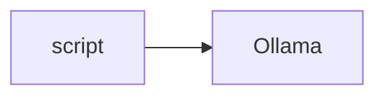

# Lab 1: Local LLM server

After this lab you have listed the local server and completed one POST.

## Data
- Script: `lab1_local_llm_server.py`

## Information
Talk to the process, not the file.

## Knowledge
1. Print host and model.
2. POST.
3. Print text.

## Wisdom
Not RAG.

## The When and Why
- **When:** the provider is local.
- **Why:** proves the engine room.

## How it works



## Data contract
Chapter 00 contract.

## Run

```bash
python education/11_engine_room/lab1_local_llm_server.py
```

## What you should see
A model reply.

## What this becomes later
Lab 2 picks among models.

## Related
- **Chapter 00:** same POST.

## Notes

