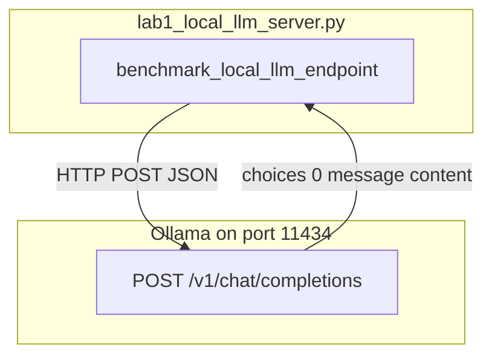

# Lab 1: Local LLM server

You listed the local server and completed one POST.

## What you touch
- Script: `lab1_local_llm_server.py`
- Function: `benchmark_local_llm_endpoint(prompt)`
- URL literal: `http://192.168.1.29:11434/v1/chat/completions`
- Model literal: `qwen3.6:35b-a3b-65k`
- Request keys: `model`, `messages` (system plus user), `temperature` 0.0, `stream` false
- Response keys read: `choices[0].message.content`, `usage.prompt_tokens`, `usage.completion_tokens`
- Return keys: `model`, `response`, `total_latency_sec`, `prompt_tokens`, `completion_tokens`, `tps`
- Prompt in `__main__`: `Explain why local-first LLM inference is critical for agent privacy and latency.`
- Timeout: 120 seconds
- Env defaults for the chapter (this script does not read them): `OLLAMA_HOST` `http://192.168.1.29:11434`, `OLLAMA_MODEL` `qwen3.6:35b-a3b-65k`

## Steps


1. Set the URL to `http://192.168.1.29:11434/v1/chat/completions` and the model to `qwen3.6:35b-a3b-65k` (or read `OLLAMA_HOST` / `OLLAMA_MODEL` in your copy).
2. Build `{ model, messages, temperature: 0.0, stream: false }`. The system line is `You are a local system architecture analyst. Keep answers to 2 concise sentences.` The user line is the prompt.
3. POST with `Content-Type: application/json` and `timeout=120`.
4. Read `choices[0].message.content`. Also read `usage` and compute `tps` as `completion_tokens / total_latency_sec`.
5. Print the banner, the URL, the model, the metrics, and `result["response"]`.
6. Do not open a `.gguf` file. Do not add a retriever. Do not start vLLM.

## Data contract
Intended chapter 00 generate POST. The reference script uses `/v1` (Notes).

**Intended request** `POST /api/generate`

```json
{
  "model": "qwen3.6:35b-a3b-65k",
  "prompt": "string",
  "stream": false
}
```

**Reference script request** `POST /v1/chat/completions`

```json
{
  "model": "qwen3.6:35b-a3b-65k",
  "messages": [
    { "role": "system", "content": "string" },
    { "role": "user", "content": "string" }
  ],
  "temperature": 0.0,
  "stream": false
}
```

**Reference script return**

```json
{
  "model": "qwen3.6:35b-a3b-65k",
  "response": "string",
  "total_latency_sec": 0.0,
  "prompt_tokens": 0,
  "completion_tokens": 0,
  "tps": 0.0
}
```

## Run
Copy `.env.example` to `.env` in the repo root and uncomment the Ollama lines. The script loads that file (it does not override vars already set in the shell).

From the repo root:

```bash
python education/11_engine_room/lab1_local_llm_server.py
```

```powershell
python education/11_engine_room/lab1_local_llm_server.py
```

Ollama must be up on port `11434`.

## What you should see
`=== STARTING LOCAL LLM SERVER & OPENAI-COMPATIBLE BENCHMARK LAB ===`. Then `[LOCAL INFRA] Connecting to OpenAI-compatible endpoint: http://192.168.1.29:11434/v1/chat/completions` and `Target Local Model: 'qwen3.6:35b-a3b-65k'`. Then `Execution Completed in ...s!` with Prompt Tokens, Completion Tokens, and Tokens/Sec. Then `=== LOCAL MODEL RESPONSE ===` and two sentences. If you see `URLError` or connection refused, the process is down. If you see HTTP 404, the model name is wrong.

## Stop here
Do not add vLLM, llama.cpp, or a RAG index. Lab 2 picks among model names. Lab 3 retries a failed POST. Chapter 13 is private data.

## Notes
- Keep the `/v1/chat/completions` URL, the two-sentence system prompt, and the TPS print.
- Contract drift vs `lab1_local_llm_server.py`: no `OLLAMA_HOST` / `OLLAMA_MODEL` read. Route is `/v1`, not `/api/generate`. Extra metrics keys. The intended contract is the chapter 00 generate POST. Write that in your copy. Do not edit the `.py` in the repo.
