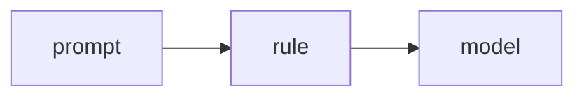

# Lab 2: Multi-model router

After this lab two prompts used two model ids.

## Data
- Script: `lab2_multi_model_router.py`

## Information
A rule sets `model`.

## Knowledge
1. Route.
2. POST each.
3. Print which model ran.

## Wisdom
Not a learned router.

## The When and Why
- **When:** tasks differ.
- **Why:** one id is not enough.

## How it works



## Data contract
`{ "model": "..." }`

## Run

```bash
python education/11_engine_room/lab2_multi_model_router.py
```

## What you should see
Two model names in the print.

## What this becomes later
Gateway lab retries the chosen host.

## Related
- **Chapter 06 router node:** intent JSON, one model.

## Notes

