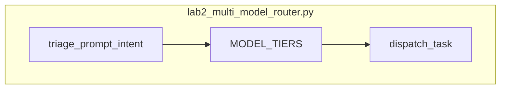

# Lab 2: Multi-model router

Two prompts used two model ids (tiers in the reference script).

## What you touch
- Script: `lab2_multi_model_router.py`
- Dict: `MODEL_TIERS` with `FAST_TIER` (`Fast SLM (7B)`, 150ms, `sql_query` / `json_extract`) and `DEEP_TIER` (`Deep LLM (35B/70B)`, 1200ms, `code_refactor` / `system_architecture`)
- Function: `triage_prompt_intent(prompt)` returns `FAST_TIER` or `DEEP_TIER`
- Deep keywords: `architecture`, `refactor`, `design pattern`, `multi-step`
- Fast keywords: `select`, `sql`, `json`, `extract`, `parse`. Default is `FAST_TIER`
- Class: `MultiModelRouterEngine.dispatch_task(prompt, force_schema_error=False)`
- Private: `_execute_tier` sleeps 0.05s and returns a dict. No HTTP.
- Three prompts in `__main__`: SQL extract (fast), architecture (deep), SQL extract with `force_schema_error=True` (fallback)
- Env defaults for the chapter (this script does not POST): `OLLAMA_HOST` `http://192.168.1.29:11434`, `OLLAMA_MODEL` `qwen3.6:35b-a3b-65k`

## Steps


1. Write `MODEL_TIERS` with the two keys above.
2. Write `triage_prompt_intent`. Lowercase the prompt. Return `DEEP_TIER` on the deep keywords, else `FAST_TIER` on the fast keywords or as default.
3. Write `dispatch_task`. Call `_execute_tier` on the chosen tier. On `ValueError`, enrich the prompt with the error text and call `_execute_tier("DEEP_TIER", ...)` with `fallback_occurred` true.
4. `_execute_tier` may `raise ValueError("Invalid JSON Schema: Missing required key 'query_plan'.")` when `force_schema_error` is true and the tier is `FAST_TIER`.
5. Run the three scenarios. Print each result dict.
6. Do not POST. Do not add OpenRouter or LiteLLM.

## Data contract
Intended POST body after the rule picks `model`. The reference script returns a simulated dict (Notes).

**Intended POST**

```json
{
  "model": "qwen3.6:35b-a3b-65k",
  "prompt": "string"
}
```

**Reference `dispatch_task` return**

```json
{
  "status": "SUCCESS",
  "tier_used": "FAST_TIER",
  "model_name": "Fast SLM (7B)",
  "simulated_latency_ms": 150,
  "fallback_occurred": false
}
```

Scenario 3 sets `tier_used` to `DEEP_TIER` and `fallback_occurred` to true.

## Run
From the repo root:

```bash
python education/11_engine_room/lab2_multi_model_router.py
```

```powershell
$env:OLLAMA_HOST="http://192.168.1.29:11434"
$env:OLLAMA_MODEL="qwen3.6:35b-a3b-65k"
python education/11_engine_room/lab2_multi_model_router.py
```

The reference script does not read those env vars and does not POST. They are listed so the Run block matches the other chapters.

## What you should see
`=== STARTING MULTI-MODEL ROUTING & FALLBACK CASCADE LAB ===`. Scenario 1 prints `Selected Initial Route: FAST_TIER` and `Result:` with `tier_used` `FAST_TIER`. Scenario 2 prints `DEEP_TIER` and `Deep LLM (35B/70B)`. Scenario 3 prints `[FAILED]` on `FAST_TIER`, then `[CASCADE]`, then `fallback_occurred` true and `tier_used` `DEEP_TIER`. If all three stay on `FAST_TIER`, the keyword lists or `force_schema_error` path is wrong.

## Stop here
Do not add a learned classifier, OpenRouter, or LiteLLM. Do not POST from this script unless you are writing your own copy. Lab 3 retries a real POST.

## Notes
- Keep the two tiers, the keyword lists, and the three scenarios.
- Contract drift vs `lab2_multi_model_router.py`: no POST, no Ollama model id, no `OLLAMA_HOST` / `OLLAMA_MODEL`. Names are display strings. Extra fallback cascade on `ValueError`. `_execute_tier` sleeps 0.05s. The intended contract is set `model` then POST. Write that in your copy. Do not edit the `.py` in the repo.
