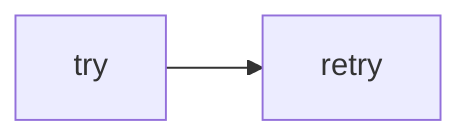

# Lab 3: Resilient gateway

After this lab a forced failure retried and then succeeded or raised.

## Data
- Script: `lab3_resilient_gateway.py`

## Information
Backoff around the chapter 01 POST.

## Knowledge
1. Call with retries.
2. Show attempt count.

## Wisdom
Not LiteLLM.

## The When and Why
- **When:** the host returns 429 or drops.
- **Why:** one try hides flakes.

## How it works



## Data contract
`max_retries: int`

## Run

```bash
python education/11_engine_room/lab3_resilient_gateway.py
```

## What you should see
Attempt logs then a result or a final error.

## What this becomes later
Chapter 15 uses this in the harness.

## Related
- **Chapter 01:** inner POST.

## Notes

