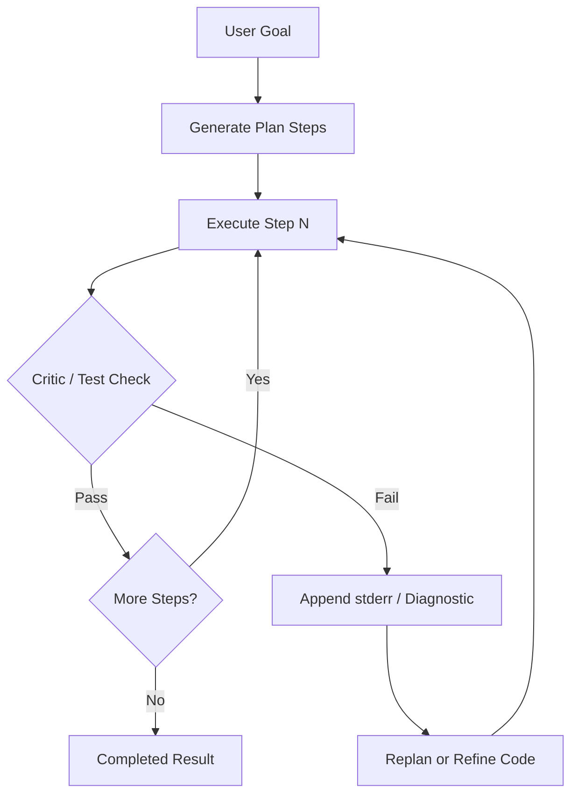

# 11: Planning and Reflection: Task Decomposition and Self-Healing Feedback Loops

By the end of this chapter, you will implement two powerful reasoning patterns: **Plan-and-Solve** (decomposing complex goals into structured step arrays with dynamic replanning) and **Reflexion** (using error tracebacks from a compiler or test critic to iterate and self-heal generated code).

In Chapter 04, we built basic ReAct loops. In this chapter, we add high-level planning to keep long-horizon tasks on track and programmatic reflection to fix errors automatically.

## Data
We define two core architectural concepts:
1. **Execution Plan**: A structured JSON array of discrete steps:
   `{"plan_id": str, "goal": str, "steps": [{"step_id": 1, "description": str, "tool_name": str, "tool_args": dict, "status": "pending"}], "replan_count": int}`.
2. **Replanning on Failure**: When a specific step fails during execution (e.g. database timeout), a replanner adjusts the remaining sub-plan without re-executing steps that already succeeded.
3. **Reflexion Critic**: A sandboxed execution environment (e.g. Python subprocess or test suite) that evaluates generated code. If execution fails, captured `stderr` and tracebacks are fed back into the prompt context to guide the next iteration.

## Information
Unstructured ReAct loops decide only one action at a time. On complex tasks with many dependencies, models easily wander off track.

Planning and reflection solve this:
- **Upfront Decomposition**: The model outlines a clear multi-step roadmap before executing any tools.
- **Self-Correcting Reflexion**: When code crashes or fails a test assertion, providing the exact traceback allows the model to diagnose what went wrong and produce a corrected patch on turn 2.

## Knowledge
Here is the step-by-step procedure:
1. Deconstruct user goals into a structured step array (`generate_initial_plan`).
2. Execute each step sequentially, resolving dependencies from prior step outputs (e.g. `$step_1_result`).
3. If a tool fails, invoke `replan_on_failure` with the error diagnostic to swap in fallback tools and adjust pending steps.
4. For code generation, write the solution to a temporary file and run it in a sandboxed critic process.
5. If the critic returns a non-zero exit code, capture `stderr` and re-prompt the model with the error trace.
6. Cap reflection loops at a strict turn limit (`max_turns = 3`) to bound execution.

## Wisdom
Planning provides inspectability and predictability for complex workflows. Reflection provides automated self-repair for verifiable artifacts like code.

## The When and Why
- **When**: Use planning when tasks require sequential, interdependent tool executions. Use reflection when outputs can be automatically verified by compilers, linters, or test suites.
- **Why**: Without planning, long tasks lose direction. Without reflection, models repeat the same code syntax errors without learning from compiler feedback.

## How it works



1. The user provides a goal and available tool schemas.
2. The model outputs a planned sequence of numbered steps with specified tool invocations.
3. The executor runs step 1; on success it advances to step 2.
4. If a step encounters an error, the error traceback is captured and reflected back to either adjust the plan or refine the generated code.
5. Once all steps complete or the retry budget is exhausted, the final status is returned.

## Data contract

**Plan Schema**

```json
{
  "plan_id": "string",
  "goal": "string",
  "steps": [
    {
      "step_id": 1,
      "description": "string",
      "tool_name": "string",
      "tool_args": {},
      "status": "pending | in_progress | completed | failed",
      "result": null,
      "error": null
    }
  ],
  "status": "pending | executing | completed | failed | replanned",
  "replan_count": 0
}
```

**Reflexion Feedback Contract**

```json
{
  "status": "SUCCESS | FAILED_MAX_TURNS",
  "turns": 1,
  "verified_code": "string",
  "error_diagnostic": null
}
```

## Lab
Done when task planning executes multiple steps with replanning on simulated failure, and reflexion automatically fixes broken code from captured `stderr`.

- Module: [this file](./00_planning_and_reflection.md)
- Lab 1: [lab1_plan_and_solve.py](./lab1_plan_and_solve.py) / [lab1_plan_and_solve.md](./lab1_plan_and_solve.md) — task decomposition and error replanning.
- Lab 2: [lab2_reflexion_loop.py](./lab2_reflexion_loop.py) / [lab2_reflexion_loop.md](./lab2_reflexion_loop.md) — code execution, critic feedback, and self-healing turns.

## Related
- **Chapter 04 (The Loop):** reactive step-by-step dispatch without upfront decomposition.
- **Chapter 06 (The Reliability):** cycle detection and retry gateway primitives.
- **Chapter 10 (The Workflow):** static hardcoded DAG pipelines.

## Notes
- Planning breaks large tasks into manageable units with explicit JSON state.
- Reflexion relies on an objective ground-truth critic (such as exit code 0 or unit tests) rather than open-ended self-assessment.
