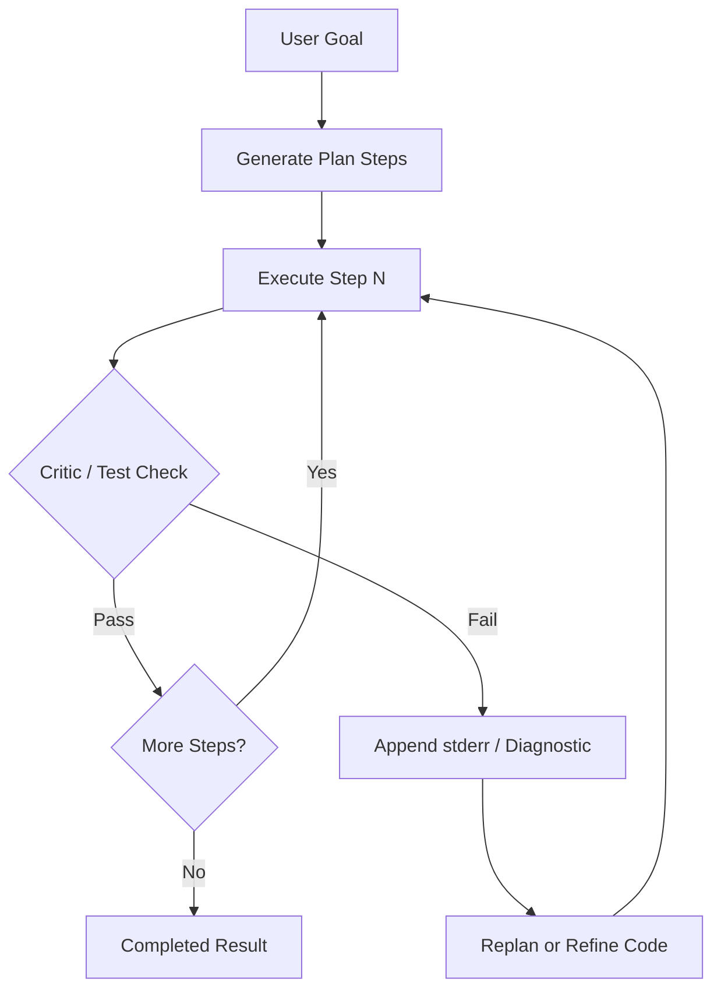

# 11: Planning and Reflection

Decompose complex goals into sequential step arrays before execution, and use feedback from test or execution failures to revise actions dynamically.

## Data
A **plan** is a structured list of discrete execution steps (`[{"step_id": 1, "description": "...", "tool_name": "...", "tool_args": {}, "status": "pending"}]`).
A **plan-and-solve executor** iterates through steps in order, passing previous step outputs into subsequent steps.
**Replanning** occurs when a step fails: the replanner generates an alternate sub-plan or modifies pending steps given the error message.
**Reflexion** is a self-correction loop where code or output is executed against a critic (e.g. a Python interpreter or test suite), and any captured `stderr` or error diagnostic is appended to the conversation context to prompt a revised attempt.
The labs in this chapter are `lab1_plan_and_solve.py` and `lab2_reflexion_loop.py`.

## Information
Direct ReAct loops decide only one step at a time without an explicit future horizon, making them prone to wandering on multi-step workflows. Planning creates an explicit global roadmap before invoking actuators.
When execution encounters an unexpected error or failing test assertion, reflection feeds the failure traceback directly back into the context window, allowing the model to analyze what broke and emit a corrected solution rather than repeating the same mistake.

## Knowledge
1. Generate an initial plan JSON array from a high-level goal using the available tool definitions.
2. Execute each plan step sequentially, updating its status to `completed` and storing its result.
3. If a step fails, invoke `replan_on_failure` with the failure diagnostic to adjust remaining steps.
4. For code generation or task verification, execute the generated artifact in a sandboxed subprocess critic.
5. If the critic returns a nonzero exit code, capture `stderr` and append it as a user/tool feedback message to trigger self-reflection.
6. Bound the reflection loop with a strict maximum turn budget (e.g. 3 turns) to prevent infinite retry loops.

## Wisdom
Planning upfront provides determinism and inspectability for multi-stage tasks. Reflection provides resilient self-healing for verifiable artifacts. Do not use full replanning when a simple deterministic script or single-turn tool dispatch is sufficient.

## The When and Why
- **When:** the task requires multiple interdependent tool calls where subsequent actions depend on prior outputs, or when generated code must pass automated validation before acceptance.
- **Why:** without planning, agents drift off-track on long horizons; without reflection, agents repeat failed actions identically without learning from errors.

## How it works



1. The user provides a goal and available tool schemas.
2. The model outputs a planned sequence of numbered steps with specified tool invocations.
3. The executor runs step 1; on success it advances to step 2.
4. If a step encounters an error, the error traceback is captured and reflected back to either adjust the plan or refine the generated code.
5. Once all steps complete or the retry budget is exhausted, the final status is returned.

## Data contract

**Plan Schema**

```json
{
  "plan_id": "string",
  "goal": "string",
  "steps": [
    {
      "step_id": 1,
      "description": "string",
      "tool_name": "string",
      "tool_args": {},
      "status": "pending | in_progress | completed | failed",
      "result": null,
      "error": null
    }
  ],
  "status": "pending | executing | completed | failed | replanned",
  "replan_count": 0
}
```

**Reflexion Feedback Contract**

```json
{
  "status": "SUCCESS | FAILED_MAX_TURNS",
  "turns": 1,
  "verified_code": "string",
  "error_diagnostic": null
}
```

## Lab
Done when task planning executes multiple steps with replanning on simulated failure, and reflexion automatically fixes broken code from captured `stderr`.

- Module: [this file](./00_planning_and_reflection.md)
- Lab 1: [lab1_plan_and_solve.py](./lab1_plan_and_solve.py) / [lab1_plan_and_solve.md](./lab1_plan_and_solve.md) — task decomposition and error replanning.
- Lab 2: [lab2_reflexion_loop.py](./lab2_reflexion_loop.py) / [lab2_reflexion_loop.md](./lab2_reflexion_loop.md) — code execution, critic feedback, and self-healing turns.

## Related
- **Chapter 04 (The Loop):** reactive step-by-step dispatch without upfront decomposition.
- **Chapter 06 (The Reliability):** cycle detection and retry gateway primitives.
- **Chapter 10 (The Workflow):** static hardcoded DAG pipelines.

## Notes
- Planning breaks large tasks into manageable units with explicit JSON state.
- Reflexion relies on an objective ground-truth critic (such as exit code 0 or unit tests) rather than open-ended self-assessment.
