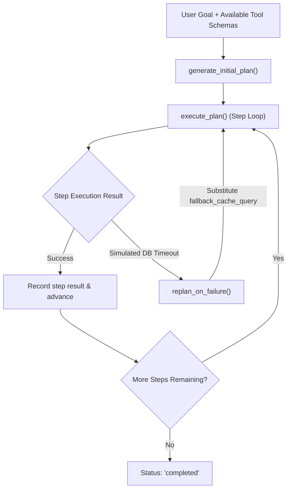

# Lab 1: Plan-and-Solve Task Decomposition with Dynamic Replanning

In this lab, you will decompose a high-level goal into a structured JSON execution plan, execute steps sequentially against a tool registry, and dynamically replan with fallback tools when an execution step fails.

---

## What you touch
- Script: `lab1_plan_and_solve.py`
- Main Functions:
  - `generate_initial_plan(goal, tool_schemas) -> dict`
  - `execute_plan(plan, tool_registry, tool_schemas) -> dict`
  - `replan_on_failure(plan, failed_step_idx, error_msg, tool_schemas) -> dict`
- Tool Registry: `primary_db_query(user_id)`, `fallback_cache_query(user_id)`, `format_user_report(user_data)`
- URL / Endpoint: `{OLLAMA_HOST}/api/generate` (defaults to `http://127.0.0.1:11434/api/generate`)
- Return Fields: `plan_id`, `goal`, `steps`, `status`, `replan_count`

---

## Steps


1. Read `OLLAMA_HOST` and `OLLAMA_MODEL` from environment variables, defaulting to `http://127.0.0.1:11434` and `llama3.2:1b`.
2. Generate an initial `ExecutionPlan` JSON dictionary containing `plan_id`, `goal`, `steps`, `status="pending"`, and `replan_count=0`.
3. Provide available tool schemas: `primary_db_query`, `fallback_cache_query`, and `format_user_report`.
4. Execute steps sequentially in `execute_plan`, resolving variable bindings from earlier step results (e.g. `$step_1_result`).
5. When `primary_db_query` encounters a simulated timeout error, intercept the failure and invoke `replan_on_failure()`.
6. Update the failed step with `fallback_cache_query`, increment `replan_count`, and re-execute the step.
7. Execute subsequent reporting steps and verify that the entire plan completes successfully.

---

## Data contract

**Initial Plan Request**

```json
{
  "goal": "Fetch account data for user 42 and generate an audit report.",
  "tool_schemas": [
    { "name": "primary_db_query", "description": "Query user from primary relational database." },
    { "name": "fallback_cache_query", "description": "Query user from high-availability cache." },
    { "name": "format_user_report", "description": "Format user details into an audit report." }
  ]
}
```

**Final Executed Plan Payload**

```json
{
  "plan_id": "plan-1787321330807",
  "goal": "Fetch account data for user 42 and generate an audit report.",
  "steps": [
    {
      "step_id": 1,
      "description": "Fetch user account record from fallback replica cache",
      "tool_name": "fallback_cache_query",
      "tool_args": { "user_id": 42 },
      "status": "completed",
      "result": "User #42: Name='Alice Smith', Role='Engineer', Source='Replica Cache'",
      "error": null
    },
    {
      "step_id": 2,
      "description": "Format and summarize user account profile",
      "tool_name": "format_user_report",
      "tool_args": { "user_data": "$step_1_result" },
      "status": "completed",
      "result": "AUDIT REPORT -> Profile: [...] | Verified: True",
      "error": null
    }
  ],
  "status": "completed",
  "replan_count": 1
}
```

---

## Run
From the repository root, run:

```bash
python education/11_planning_and_reflection/lab1_plan_and_solve.py
```

```powershell
python education/11_planning_and_reflection/lab1_plan_and_solve.py
```

---

## What you should see
- Initial structured plan decomposition into discrete steps.
- Execution of Step 1 triggering the primary DB error.
- `[REPLANNER TRIGGERED]` alert showing substitution of `fallback_cache_query`.
- Step 2 resolving `$step_1_result` and producing the audit report.
- Final JSON plan output with `status: "completed"` and `replan_count: 1`.

---

## Stop here
You have successfully decomposed goals into structured plans with dynamic replanning! In Lab 2, we will build a self-healing code reflection loop.

Next up: [Lab 2: Reflexion Loop](./lab2_reflexion_loop.md).

---

## Notes
*(Record your plan execution and replanning trace here)*

