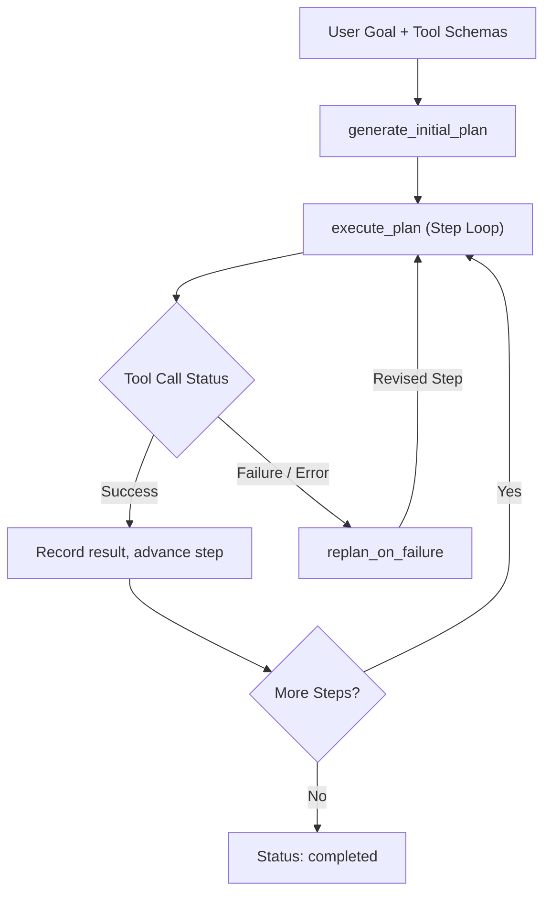

# Lab 1: Plan and solve

Decompose a high-level goal into a structured JSON execution plan, execute steps sequentially against a tool registry, and dynamically replan when a step fails.
This file is the brief. It is short. It does not reteach the module. Read the module first.

## What you touch
- Script: `lab1_plan_and_solve.py`
- Functions: `generate_initial_plan(goal, tool_schemas)`, `execute_plan(plan, tool_registry, tool_schemas)`, `replan_on_failure(plan, failed_step_idx, error_msg, tool_schemas)`
- Tools: `primary_db_query(user_id)`, `fallback_cache_query(user_id)`, `format_user_report(user_data)`
- URL / path: `{OLLAMA_HOST}/api/generate` (default `http://127.0.0.1:11434/api/generate`)
- Keys sent: `model`, `prompt`, `stream` (`false`), `options.temperature` (`0.0`)
- Keys read: `response`
- Return keys: `plan_id`, `goal`, `steps`, `status`, `replan_count`

## Steps


1. Read `OLLAMA_HOST` and `OLLAMA_MODEL` from the environment via `load_env()`.
2. Generate an `ExecutionPlan` JSON dictionary with `plan_id`, `goal`, `steps` array, `status="pending"`, and `replan_count=0`.
3. Provide available tool schemas (`primary_db_query`, `fallback_cache_query`, `format_user_report`).
4. Execute steps sequentially in `execute_plan`. Resolve inter-step variable references (e.g. `$step_1_result`).
5. Handle step execution failure: when `primary_db_query` encounters an error, intercept the failure string and invoke `replan_on_failure`.
6. Update the failed step in place with an alternate fallback tool (`fallback_cache_query`) and increment `replan_count`.
7. Re-execute the revised step and continue remaining pipeline steps until all complete.
8. Output the final completed `ExecutionPlan` payload.

## Data contract
Only the keys this script sends and reads.

**Initial Plan Request**

```json
{
  "goal": "Fetch account data for user 42 and generate an audit report.",
  "tool_schemas": [
    { "name": "primary_db_query", "description": "Query user from primary relational database." },
    { "name": "fallback_cache_query", "description": "Query user from high-availability cache." },
    { "name": "format_user_report", "description": "Format user details into an audit report." }
  ]
}
```

**Plan Output Schema**

```json
{
  "plan_id": "plan-1787321330807",
  "goal": "Fetch account data for user 42 and generate an audit report.",
  "steps": [
    {
      "step_id": 1,
      "description": "Fetch user account record from fallback replica cache",
      "tool_name": "fallback_cache_query",
      "tool_args": { "user_id": 42 },
      "status": "completed",
      "result": "User #42: Name='Alice Smith', Role='Engineer', Source='Replica Cache'",
      "error": null
    },
    {
      "step_id": 2,
      "description": "Format and summarize user account profile",
      "tool_name": "format_user_report",
      "tool_args": { "user_data": "$step_1_result" },
      "status": "completed",
      "result": "AUDIT REPORT -> Profile: [...] | Verified: True",
      "error": null
    }
  ],
  "status": "completed",
  "replan_count": 1
}
```

## Run
From the repo root. The script loads `.env` (copy `.env.example` to `.env` first).

```text
python education/11_planning_and_reflection/lab1_plan_and_solve.py
```

## What you should see
An initial JSON plan decomposition, execution of Step 1 triggering simulated primary DB timeout, `[REPLANNER TRIGGERED]` alert, execution of replacement `fallback_cache_query` step, successful execution of Step 2, and final JSON plan status `"completed"` with `replan_count: 1`. If tool execution fails unhandled, check tool parameter dictionary matching.

## Stop here
This lab decomposes tasks into sequential step arrays and handles runtime tool replanning. Do not add asynchronous swarm workers or sandboxed Python interpreters here. Code evaluation and self-healing loops belong in Lab 2.

## Notes
- Planning isolates decomposition from execution, ensuring every tool invocation has an inspectable step index and argument payload.
- Replanning adapts only the failed and downstream steps, preserving successfully completed step results.
