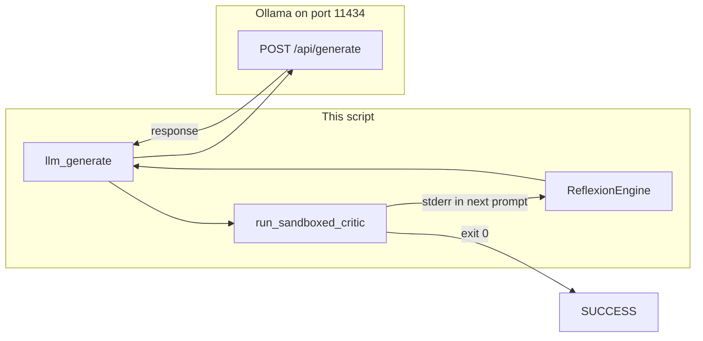

# Lab 2: Reflexion loop

After this lab a failed check produced a second attempt with the error in context. This is not a new model. It is the same POST plus the traceback.

## What you touch
- Script: `lab2_reflexion_loop.py`
- Class / functions: `ReflexionEngine.run_reflexion_loop(task_goal)`, `llm_generate(prompt)`, `run_sandboxed_critic(temp_dir)`
- File written: `solution.py` inside a temp dir
- URL / path: `{OLLAMA_HOST}/api/generate` (default `http://192.168.1.29:11434/api/generate`)
- Keys sent: `model`, `prompt`, `stream` (`false`), `options.temperature` (`0.0`)
- Keys read: `response`
- Checker: process exit code and `stderr`
- Return keys: `status`, `turns`, and on pass `verified_code`

## Steps


1. Read `OLLAMA_HOST` and `OLLAMA_MODEL` from the environment. If they are unset, use `http://192.168.1.29:11434` and `qwen3.6:35b-a3b-65k`.
2. First answer: `llm_generate` POSTs `model`, `prompt`, `stream: false`, `options.temperature: 0.0`. The baked goal is `Create a function safe_divide(a, b) that divides a by b, handling ZeroDivisionError gracefully, and print safe_divide(10, 0).`
3. Write the returned text to `solution.py`. Run it with `run_sandboxed_critic`. Exit `0` is pass. Return `{ "status": "SUCCESS", "turns": n, "verified_code": "..." }`.
4. Fail a check: nonzero exit. Print `stderr`. Append that error (and the prior code) to the next prompt.
5. Retry with the error in context. `max_turns` is 3. If the same `stderr` MD5 is in `seen_signatures`, the next prompt asks for a different strategy.
6. If the cap is hit, return `{ "status": "FAILED_MAX_TURNS", "turns": 3 }`.
7. Do not swap in a second model. The checker is the exit code.

## Data contract
Only the keys this script sends and reads.

**Request** `POST /api/generate`

```json
{
  "model": "qwen3.6:35b-a3b-65k",
  "prompt": "string",
  "stream": false,
  "options": { "temperature": 0.0 }
}
```

The error string lives in the next `prompt`, not in a `messages` list.

**Pass return**

```json
{
  "status": "SUCCESS",
  "turns": 1,
  "verified_code": "string"
}
```

**Cap return**

```json
{
  "status": "FAILED_MAX_TURNS",
  "turns": 3
}
```

## Run
Copy `.env.example` to `.env` in the repo root and uncomment the Ollama lines. The script loads that file (it does not override vars already set in the shell).

From the repo root:

```bash
python education/11_planning_and_reflection/lab2_reflexion_loop.py
```

```powershell
python education/11_planning_and_reflection/lab2_reflexion_loop.py
```

## What you should see
One or more `[TURN n]` blocks. A fail prints `[FAILED]` and `[CRITIC TRACEBACK]`. A later turn should be closer to the check (exit `0`, or a different error). A pass prints `[PASSED]` and `SUCCESS`. A cap prints `FAILED_MAX_TURNS`. If you see `URLError` or connection refused, the provider is not reachable. If you see HTTP 404, the model name is wrong or not pulled. If every turn is the same traceback, the error was not appended.

## Stop here
This is not a new model and not an eval suite. Chapter 04 is the outer `for`. This lab only appends the error. Evals (lab4) can score many of these runs. Do not add logit bias or a trace backend here.

## Notes
- Mechanism: generate, run `solution.py`, append `stderr`, retry inside `max_turns`.
- Contract drift vs `lab2_reflexion_loop.py`: no `OLLAMA_HOST` / `OLLAMA_MODEL` read (URL and model are literals). Route is `/api/generate`, not `/api/chat`, so the error is concatenated into `prompt` rather than appended as a `messages` item. `llm_generate` strips a leading python fence. Oscillation uses MD5 of `stderr`, not the SHA-256 tool hash from `lab2_cycle_detection.py`. Write env reads in your copy. Leave the reference file as-is.
