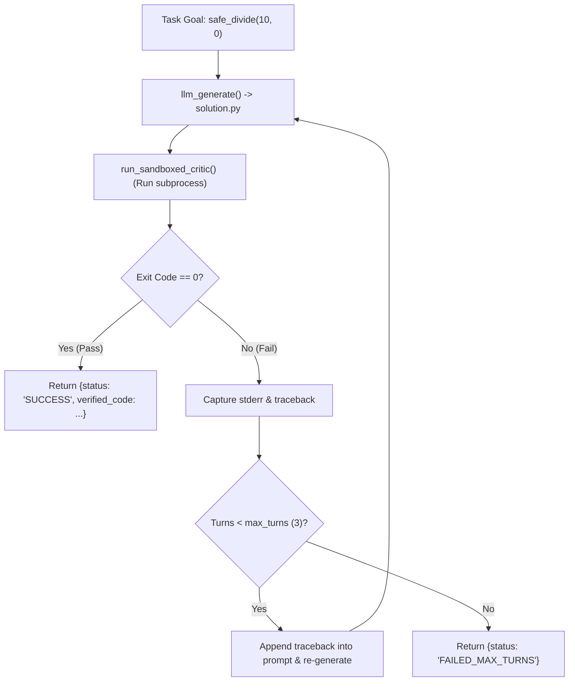

# Lab 2: Building a Self-Healing Reflexion Loop with Critic Feedback

In this lab, you will build a Reflexion engine that generates Python code, executes it in a sandboxed critic process, captures any resulting `stderr` or tracebacks upon failure, and reflects the diagnostic back into the model prompt to produce a working fix.

---

## What you touch
- Script: `lab2_reflexion_loop.py`
- Main Classes & Functions:
  - `ReflexionEngine.run_reflexion_loop(task_goal) -> dict`
  - `llm_generate(prompt) -> str`
  - `run_sandboxed_critic(temp_dir) -> tuple[int, str]`
- Generated Code File: `solution.py` created in a temporary directory
- URL / Endpoint: `{OLLAMA_HOST}/api/generate` (defaults to `http://127.0.0.1:11434/api/generate`)
- Ground-Truth Critic: Exit code 0 (Pass) vs Non-zero with captured `stderr` (Fail)

---

## Steps


1. Read `OLLAMA_HOST` and `OLLAMA_MODEL` from environment variables, defaulting to `http://127.0.0.1:11434` and `llama3.2:1b`.
2. Provide the task goal:
   `"Create a function safe_divide(a, b) that divides a by b, handling ZeroDivisionError gracefully, and print safe_divide(10, 0)."`
3. Implement `llm_generate(prompt)` to send a prompt to `{OLLAMA_HOST}/api/generate` and strip markdown code fences.
4. Implement `run_sandboxed_critic(temp_dir)` to run `python solution.py` via `subprocess.run()`, capturing return code, stdout, and stderr.
5. In `run_reflexion_loop()`:
   - Loop `turn` from 1 up to `max_turns = 3`.
   - Write model-generated code to `solution.py` and execute the critic.
   - If exit code is `0`, return `{"status": "SUCCESS", "turns": turn, "verified_code": code}`.
   - If exit code is non-zero, capture `stderr`, append the diagnostic to the next iteration's prompt, and repeat.
6. Verify that broken initial attempts (e.g. unhandled ZeroDivisionError) self-heal into passing code on subsequent turns.

---

## Data contract

**Reflexion Feedback Prompt Structure**

```text
The previous code execution failed with the following diagnostic error:
[CRITIC TRACEBACK]
ZeroDivisionError: division by zero

Please analyze this error and output a corrected, complete Python implementation.
```

**Success Return Payload**

```json
{
  "status": "SUCCESS",
  "turns": 2,
  "verified_code": "def safe_divide(a, b):\n    try:\n        return a / b\n    except ZeroDivisionError:\n        return None\n\nprint(safe_divide(10, 0))"
}
```

---

## Run
From the repository root, run:

```bash
python education/11_planning_and_reflection/lab2_reflexion_loop.py
```

```powershell
python education/11_planning_and_reflection/lab2_reflexion_loop.py
```

---

## What you should see
- **Turn 1**: Initial code generated, critic execution failing with `[FAILED]` and `[CRITIC TRACEBACK]`.
- **Turn 2**: Re-prompt with captured error, followed by corrected code passing critic execution with `[PASSED]` and status `SUCCESS`.

---

## Stop here
You have successfully implemented a self-healing reflexion loop! In Chapter 12, we will build evaluation suites to score agent reliability and accuracy.

Next up: [Chapter 12: Agent Evals](../12_agent_evals/00_agent_evals.md).

---

## Notes
*(Record your reflexion trace and self-healed code here)*

