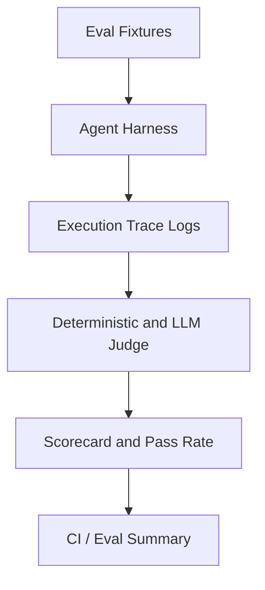

# 12: Agent Evals

Benchmark agent performance, accuracy, and trajectory quality using deterministic test fixtures, scorecards, and model-graded evaluation suites.

## Data
An **eval fixture** is a structured test case containing input stimuli, expected behaviors, and grading criteria (`{"id": "eval_01", "prompt": "...", "expected_tools": ["..."], "expected_output": "..."}`).
An **evaluator** runs an agent against a dataset of fixtures and records execution metrics: turn counts, latency, tool call sequences, and final output correctness.
A **scorecard** aggregates results into quantitative metrics (pass rate percentage, precision, average turns to completion).
A **model-based judge** is an optional secondary evaluation prompt where an LLM inspects agent trajectory logs against a rubric to assign a qualitative rating (`{"score": 1..5, "verdict": "PASS | FAIL", "reason": "..."}`).
The lab for this chapter is `lab1_agent_evals.py`.

## Information
Agent systems are non-deterministic: code edits or prompt tweaks that improve one test case may silently degrade others. Automated evaluation suites provide regression testing for agent behavior across diverse edge cases.
Deterministic evaluations test explicit contracts (e.g. valid JSON output, expected tool invocations, exit codes). Model-graded evaluations test open-ended linguistic quality, reasoning adherence, and safety boundaries.

## Knowledge
1. Define a benchmark dataset of test cases covering standard tasks, ambiguous inputs, and adversarial prompts.
2. Instrument the agent execution kernel to record span traces (input prompt, tool call arguments, tool outputs, turn count, token usage).
3. Execute the agent over the fixture set under deterministic generation settings (`temperature: 0.0`).
4. Evaluate outputs using exact match assertions, regex assertions, JSON schema validation, or model judge rubrics.
5. Generate an evaluation report with overall pass rate, per-category accuracy, and failure breakdown.
6. Run evals as part of continuous integration before deploying agent changes.

## Wisdom
Always start with fast, deterministic code-based assertions before adding expensive LLM judges. A failing unit test or missing JSON key is unambiguous; LLM judges can suffer from grading variance and prompt sensitivity.

## The When and Why
- **When:** modifying prompts, updating system instructions, refactoring tools, or changing the underlying model provider.
- **Why:** manual spot-checking misses subtle regressions; comprehensive evals verify agent reliability quantitatively across known test vectors.

## How it works



1. The test runner loads fixture test cases from a dataset.
2. Each test case runs through the agent harness with tracing enabled.
3. Deterministic checkers verify tool calls, argument schemas, and output formats.
4. If configured, a judge prompt evaluates qualitative reasoning.
5. The runner computes aggregated metrics and prints a structured scorecard.

## Data contract

**Eval Fixture Item**

```json
{
  "case_id": "string",
  "category": "string",
  "prompt": "string",
  "expected_tool": "string",
  "expected_substring": "string"
}
```

**Eval Result Summary**

```json
{
  "total_cases": 10,
  "passed": 9,
  "failed": 1,
  "pass_rate": 0.9,
  "average_turns": 2.3,
  "results": [
    {
      "case_id": "string",
      "verdict": "PASS | FAIL",
      "turns": 2,
      "error": null
    }
  ]
}
```

## Lab
Done when an automated eval suite executes across multiple agent test cases and prints a structured pass rate scorecard.

- Module: [this file](./00_agent_evals.md)
- Lab 1: [lab1_agent_evals.py](./lab1_agent_evals.py) / [lab1_agent_evals.md](./lab1_agent_evals.md) — fixture benchmark runner, execution tracer, and scorecard generator.

## Related
- **Chapter 06 (The Reliability):** runtime cycle detection and logit steering.
- **Chapter 11 (Planning and Reflection):** inline sandboxed critic for single-turn code fixing.
- **pytest / standard unit tests:** traditional code testing vs agent trajectory evaluation.

## Notes
- Evals should be run with fixed seeds and zero temperature to maximize reproducibility.
- Track both task success rate and efficiency (turn count / latency) to detect regressions in agent economy.
