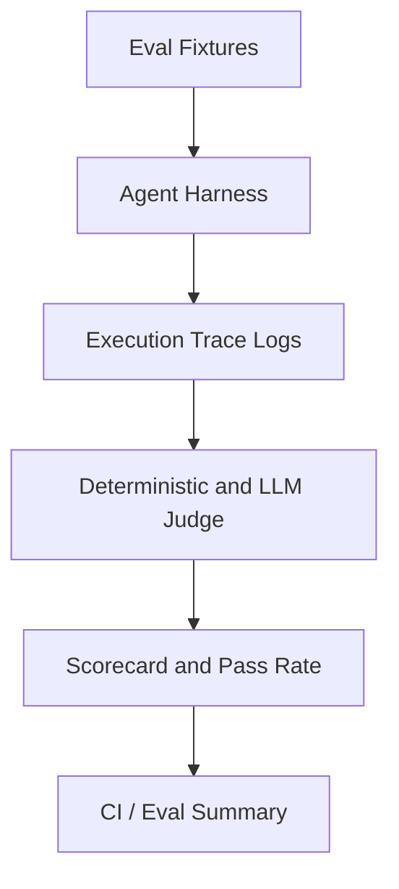

# 12: Agent Evals: Benchmarking Accuracy and Execution Traces

By the end of this chapter, you will build an automated evaluation suite to benchmark agent performance, trace execution spans, verify structured outputs against deterministic fixtures, and compute pass-rate scorecards.

In Chapter 11, we built reflection loops for single-task repair. In this chapter, we evaluate systemic agent behavior across whole test suites to prevent regressions as prompts, tools, and models evolve.

## Data
We define four core evaluation components:
1. **Eval Fixtures**: Standardized test cases with expected outputs:
   `{"id": "case_01", "prompt": str, "expected_tool": str, "expected_output": str}`.
2. **Execution Tracer**: Instruments the agent runtime to record execution spans (e.g. latency, turn count, token usage, tool invocations).
3. **Deterministic & LLM Evaluators**:
   - **Deterministic Checkers**: Regex pattern matching, JSON schema validation, or tool invocation assertions.
   - **LLM Judge**: Evaluates qualitative reasoning and rubric alignment, returning a structured score (`{"score": int, "verdict": "PASSED" | "FAILED", "reason": str}`).
4. **Summary Scorecard**: Aggregates test runs into quantitative metrics (`{"total_cases": int, "passed": int, "failed": int, "pass_rate": float}`).

## Information
Agent systems are non-deterministic. An update that improves one prompt might unexpectedly break edge cases elsewhere.

Evaluation suites provide essential regression testing:
- **Fast Deterministic Checks**: Test strict contracts (e.g. valid JSON formatting, correct tool selection, clean error exits).
- **Graded Rubrics**: Evaluate complex conversational responses or open-ended reasoning.
- **Continuous Benchmarking**: Run evals in CI pipelines before deploying prompt or agent architecture changes.

## Knowledge
Here is the step-by-step procedure:
1. Define a benchmark dataset of test fixtures covering expected tasks and edge cases.
2. Instrument the agent execution harness with tracing spans to log latency and tool calls.
3. Run the evaluation suite with zero temperature (`temperature: 0.0`) for maximum reproducibility.
4. Evaluate agent trajectory logs using deterministic assertions or an LLM judge.
5. Calculate aggregate statistics (overall pass rate, average latency, turn count).

## Wisdom
Always start with deterministic, code-based assertions before adding expensive LLM judges. Unit assertions are fast, cheap, and unambiguous.

## The When and Why
- **When**: Whenever you modify system prompts, update tool schemas, refactor dispatcher code, or test new foundation models.
- **Why**: Manual spot-checking cannot catch subtle behavior regressions across diverse workflows. Automated evals provide quantitative proof of reliability.

## How it works



1. The test runner loads fixture test cases from a dataset.
2. Each test case runs through the agent harness with tracing enabled.
3. Deterministic checkers verify tool calls, argument schemas, and output formats.
4. If configured, a judge prompt evaluates qualitative reasoning.
5. The runner computes aggregated metrics and prints a structured scorecard.

## Data contract

**Eval Fixture Item**

```json
{
  "case_id": "string",
  "category": "string",
  "prompt": "string",
  "expected_tool": "string",
  "expected_substring": "string"
}
```

**Eval Result Summary**

```json
{
  "total_cases": 10,
  "passed": 9,
  "failed": 1,
  "pass_rate": 0.9,
  "average_turns": 2.3,
  "results": [
    {
      "case_id": "string",
      "verdict": "PASS | FAIL",
      "turns": 2,
      "error": null
    }
  ]
}
```

## Lab
Done when an automated eval suite executes across multiple agent test cases and prints a structured pass rate scorecard.

- Module: [this file](./00_agent_evals.md)
- Lab 1: [lab1_agent_evals.py](./lab1_agent_evals.py) / [lab1_agent_evals.md](./lab1_agent_evals.md) — fixture benchmark runner, execution tracer, and scorecard generator.

## Related
- **Chapter 06 (The Reliability):** runtime cycle detection and logit steering.
- **Chapter 11 (Planning and Reflection):** inline sandboxed critic for single-turn code fixing.
- **pytest / standard unit tests:** traditional code testing vs agent trajectory evaluation.

## Notes
- Evals should be run with fixed seeds and zero temperature to maximize reproducibility.
- Track both task success rate and efficiency (turn count / latency) to detect regressions in agent economy.
