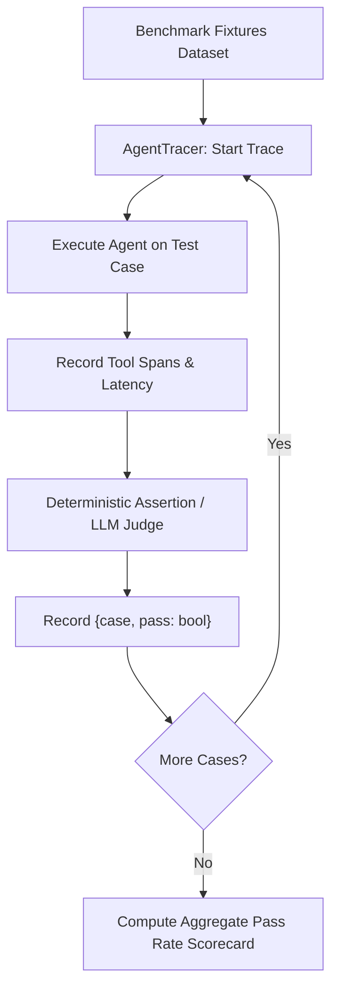

# Lab 1: Building an Agent Benchmark Suite and Execution Tracer

In this lab, you will build an automated evaluation runner that executes a dataset of test fixtures against an agent harness, records OpenTelemetry-style span traces, and computes a quantitative pass/fail scorecard.

---

## What you touch
- Script: `lab1_agent_evals.py`
- Main Classes & Functions:
  - `AgentTracer` (records span latency, trace IDs, and span metadata)
  - `llm_judge_evaluator(task_prompt, trajectory_trace) -> dict`
  - `run_eval_suite(test_fixtures) -> dict`
- URL / Endpoint: `{OLLAMA_HOST}/api/generate` (defaults to `http://127.0.0.1:11434/api/generate`)
- Target Metric: Aggregated pass rate across fixture cases (`{"pass": n, "total": m}`)

---

## Steps


1. Read `OLLAMA_HOST` and `OLLAMA_MODEL` from environment variables, defaulting to `http://127.0.0.1:11434` and `llama3.2:1b`.
2. Define a list of test fixtures specifying prompts and expected verification criteria (e.g. string matching or JSON key existence).
3. Implement `AgentTracer` to collect execution traces with `trace_id`, `span_id`, tool invocations, and timing durations.
4. Execute each fixture through the agent harness under deterministic settings (`temperature: 0.0`).
5. Evaluate outputs against expectations using deterministic checkers or `llm_judge_evaluator`.
6. Compute and display the overall scorecard (`pass_count / total_cases`) and failure details if any.

---

## Data contract

**Fixture Case Structure**

```json
{
  "case_id": "test_factorial_01",
  "prompt": "Calculate factorial of 5",
  "expected_substring": "120"
}
```

**Scorecard Summary**

```json
{
  "total_cases": 4,
  "passed": 4,
  "failed": 0,
  "pass_rate": 1.0,
  "results": [
    { "case_id": "test_factorial_01", "verdict": "PASSED", "duration_ms": 320 }
  ]
}
```

---

## Run
From the repository root, run:

```bash
python education/12_agent_evals/lab1_agent_evals.py
```

```powershell
python education/12_agent_evals/lab1_agent_evals.py
```

---

## What you should see
- Execution trace spans showing start time, tool execution, and duration in milliseconds.
- Evaluator verdict logs (`PASSED` / `FAILED`) per test case.
- Summary scorecard printing overall pass rate and case totals.

---

## Stop here
You have successfully benchmarked agent trajectories! In Chapter 13, we will assemble complete end-to-end agents with system kernels and persistent working memories.

Next up: [Chapter 13: One Agent](../13_one_agent/00_one_agent.md).

---

## Notes
*(Record your evaluation benchmark results and scorecard here)*

