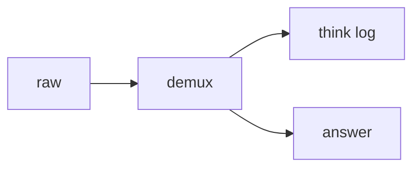

# 12: Chain of thought

After this page thinking tokens are a separate channel from the user string.

## Data
- Tags: `<think>...</think>`
- Lab kept: `lab1_cot_demuxer`
- Duplicate deleted: `labs/01_single_agent/lab3_reasoning_demux`

## Information
Chapter 01 notes already saw 766 eval tokens for two sentences. This chapter splits them.

## Knowledge
1. Scan the stream or the full string.
2. Buffer inside the tags to a think log.
3. Return the rest as the answer.

## Wisdom
Do not keep two demux labs.

## The When and Why
- **When:** the model emits think tags.
- **Why:** UI and `json.loads` break on raw think text.

## How it works

## Data contract
`{ "thinking": "string", "response": "string" }`

## Lab
- [lab1_cot_demuxer.py](./lab1_cot_demuxer.py) / [lab1_cot_demuxer.md](./lab1_cot_demuxer.md)

## Related
- **Chapter 07 kernel:** already calls a small demuxer.

## Notes
One CoT lab only.
