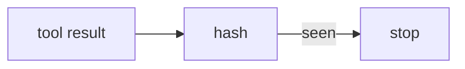

# 12: Cycle detect and steering

After this page a repeated tool signature stops the loop, and optional logit bias can block tokens.

## Data
- Cycle: hash(`tool_name + args + result`)
- Lab: `lab2_cycle_detection`, `lab2_logit_steering`

## Information
Chapter 04 loop can spin. Hash the last N turns.

## Knowledge
1. After each tool, hash the signature.
2. If seen, halt.
3. Optional: set logit bias / stop strings.

## Wisdom
Do not add MCTS.

## The When and Why
- **When:** the same tool+args repeats.
- **Why:** a cap on turns is not enough if it oscillates.

## How it works

## Data contract
Hash key: string.

## Lab
- [lab2_cycle_detection.py](./lab2_cycle_detection.py) / [lab2_cycle_detection.md](./lab2_cycle_detection.md)
- [lab2_logit_steering.py](./lab2_logit_steering.py) / [lab2_logit_steering.md](./lab2_logit_steering.md)

## Related
- **max_turns:** the blunt stop from chapter 04.

## Notes
Moved from modules/08 and labs/01 lab2.
