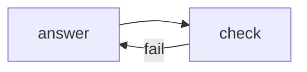

# 12: Reflexion and evals

After this page a failed check is appended and the loop retries, and a second script scores outputs.

## Data
- Reflexion lab: `lab3_reflexion_loop`
- Evals lab: `lab2_agent_evals`
- Eval module: moved from 04/01 if present as notes here

## Information
Observation of failure → next user/tool message → retry. Evals are a list of cases + a score function.

## Knowledge
1. Run.
2. If check fails, append the error.
3. Retry within a cap.
4. For evals, run a fixture list and print pass count.

## Wisdom
Do not build a full observability platform.

## The When and Why
- **When:** the first answer is wrong and you have a checker.
- **Why:** without the error in context the next turn repeats.

## How it works

## Data contract
Eval row: `{ "case": "string", "pass": true }`.

## Lab
- [lab3_reflexion_loop.py](./lab3_reflexion_loop.py) / [lab3_reflexion_loop.md](./lab3_reflexion_loop.md)
- [lab2_agent_evals.py](./lab2_agent_evals.py) / [lab2_agent_evals.md](./lab2_agent_evals.md)

## Related
- **unit test:** the checker.

## Notes
Moved from modules/08/02 and labs/04/lab2.
