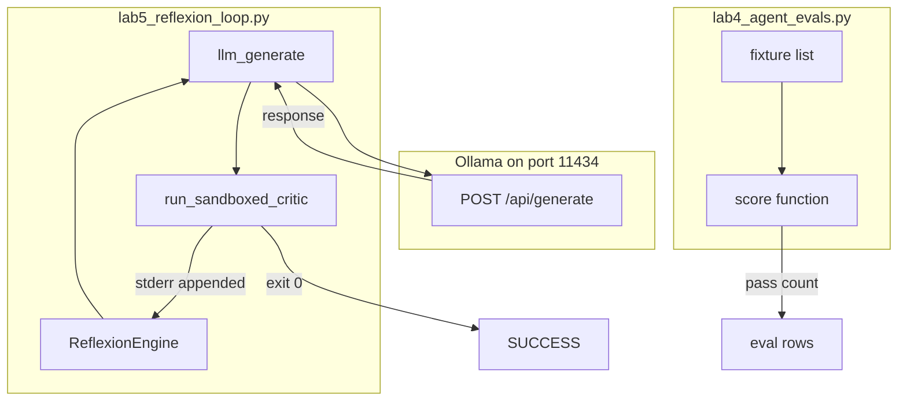

# 12: Reflexion and evals

After this page a failed check is appended and the loop retries, and a second script scores outputs. The checker is a unit test (or an exit code). The score is a list of cases plus a pass count.

## Data
**Reflexion** is: run, check, if the check fails append the error to the next prompt, retry, stop at a cap. The lab file is `lab5_reflexion_loop.py`. Class `ReflexionEngine` has `run_reflexion_loop(task_goal)` and `max_turns` (default 3). The checker is `run_sandboxed_critic`: it writes `solution.py` in a temp dir and runs it. Exit code `0` is pass. Nonzero is fail, and `stderr` is the error you append.

**Evals** are a fixture list plus a score function. The intended row is `{ "case": "string", "pass": true }`. Print how many passed. The lab file is `lab4_agent_evals.py`.

`OLLAMA_HOST` should default to `http://192.168.1.29:11434`. `OLLAMA_MODEL` should default to `qwen3.6:35b-a3b-65k`. Both labs use `POST /api/generate`.

An older eval writeup lived under `04/01` and `labs/04/lab2`. The notes belong here now.

## Information
Without the error in context, the next turn is the same prompt and often the same wrong answer. Reflexion is the append. The critic does not have to be another model. An exit code and `stderr` are enough.

Evals are not the retry. They are a list you run after you have an output. Each case is pass or fail. A pass count is the score. A second model that returns `{ "score", "verdict", "reason" }` is one way to score. A fixture list you wrote yourself is the intended way on this page.

Do not build a full observability platform (trace ids, span trees, exporters). A print of pass count is enough.

## Knowledge
1. Generate an answer (`llm_generate` POSTs `model`, `prompt`, `stream: false`, `options.temperature: 0.0`).
2. Run the checker. For the reflexion lab that is `run_sandboxed_critic` on `solution.py`.
3. If the check fails, append the error (`stderr`) to the next prompt. Retry inside `max_turns`.
4. If the same error hash appears again, say so and change the prompt. Do not silently repeat.
5. For evals, run a fixture list and print the pass count. Each row is `{ "case", "pass" }`.
6. Do not add a trace backend.

## Wisdom
Append the error and retry inside a small cap. Score with a list of cases. If you add spans, exporters, and a judge model now, a fail could come from the checker, the judge, or the tracer.

## The When and Why
- **When:** the first answer is wrong and you have a checker.
- **Why:** without the error in context the next turn repeats the same answer.

## How it works



Walkthrough of reflexion:

1. `run_reflexion_loop` asks `llm_generate` for a Python script. The baked goal is `safe_divide(a, b)` that handles `ZeroDivisionError` and prints `safe_divide(10, 0)`.
2. The script writes that code to `solution.py` and runs it. Exit `0` returns `{ "status": "SUCCESS", "turns": n, "verified_code": "..." }`.
3. A nonzero exit appends `stderr` to the next prompt and retries. `max_turns` is 3. The same `stderr` MD5 in `seen_signatures` is an oscillation: the next prompt asks for a different strategy.
4. Hitting the cap returns `{ "status": "FAILED_MAX_TURNS", "turns": 3 }`.

Walkthrough of evals (intended):

1. You have a list of cases (prompt plus expected check).
2. You run each case through the same generate-and-check path.
3. You print one row per case and a pass count.

## Data contract

**Generate request** `POST /api/generate`

```json
{
  "model": "qwen3.6:35b-a3b-65k",
  "prompt": "string",
  "stream": false,
  "options": { "temperature": 0.0 }
}
```

**Reflexion return (pass)**

```json
{
  "status": "SUCCESS",
  "turns": 1,
  "verified_code": "string"
}
```

**Reflexion return (cap)**

```json
{
  "status": "FAILED_MAX_TURNS",
  "turns": 3
}
```

**Intended eval row**

```json
{
  "case": "string",
  "pass": true
}
```

## Lab
Done when a failed check is appended and retried, and a second script prints a pass count.

- Module: [this file](./02_reflexion_and_evals.md)
- Lab 5: [lab5_reflexion_loop.py](./lab5_reflexion_loop.py) / [lab5_reflexion_loop.md](./lab5_reflexion_loop.md) - generate, run `solution.py`, append `stderr`, retry. Done when you see `SUCCESS` or `FAILED_MAX_TURNS`.
- Lab 4 (evals): [lab4_agent_evals.py](./lab4_agent_evals.py) / [lab4_agent_evals.md](./lab4_agent_evals.md) - fixture list plus score. Done when a pass count prints.

## Related
- **unit test:** the checker. Exit code `0` or a boolean. Not a dashboard.
- **Chapter 12 cycle hash:** previous file. Reflexion retries a new prompt. A cycle hash stops the same tool step.

## Notes
- Moved from `modules/08/02` and `labs/04/lab2`. Evals are lab4. Reflexion is lab5.
- Contract drift vs `lab5_reflexion_loop.py`: no `OLLAMA_HOST` / `OLLAMA_MODEL` read (URL and model are literals). Route is `/api/generate`. `llm_generate` strips a leading ` ```python ` fence. Oscillation uses MD5 of `stderr`, not the cycle SHA-256 from the previous page.
- Contract drift vs `lab4_agent_evals.py`: no fixture list and no `{ "case", "pass" }` rows. The script builds `AgentTracer` spans (`trace_id`, `span_id`, `duration_ms`) and calls `llm_judge_evaluator`, which POSTs a second generate and expects `{ "score", "verdict", "reason" }`. That is a mini observability stack plus an LLM judge. The intended contract on this page is still a case list and a pass count. Write that in your copy. Leave the reference files as-is.
