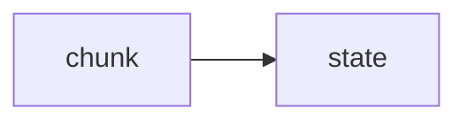

# Lab 1: CoT demuxer

After this lab `<think>` text is not in the user string.

## Data
- Script: `lab1_cot_demuxer.py`

## Information
State machine over the buffer.

## Knowledge
1. Feed chunks.
2. Print think vs response.

## Wisdom
Duplicate `lab3_reasoning_demux` is deleted.

## The When and Why
- **When:** the model thinks in tags.
- **Why:** parsers choke on tags.

## How it works



## Data contract
`{thinking, response}`

## Run

```bash
python education/12_reliability/lab1_cot_demuxer.py
```

## What you should see
Two channels printed.

## What this becomes later
Chapter 10 shows only response.

## Related
- **Chapter 07:** smaller copy of this.

## Notes

