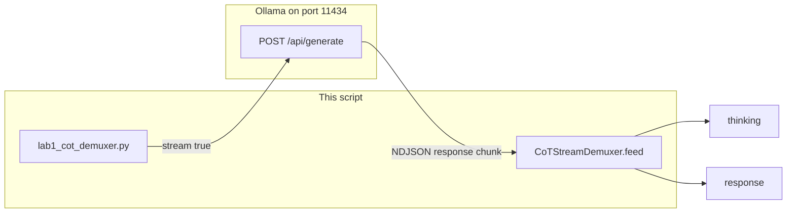

# Lab 1: CoT demuxer

After this lab `<think>` text is not in the user-visible string. Two channels print: thinking and response.

## What you touch
- Script: `lab1_cot_demuxer.py`
- Class / function: `CoTStreamDemuxer.feed(chunk)`
- URL / path: `{OLLAMA_HOST}/api/generate` (default `http://192.168.1.29:11434/api/generate`)
- Keys sent: `model`, `prompt`, `stream` (`true`), `options.temperature` (`0.0`)
- Keys read: each line `response`
- Intended result keys: `thinking`, `response`

## Steps


1. Read `OLLAMA_HOST` and `OLLAMA_MODEL` from the environment. If they are unset, use `http://192.168.1.29:11434` and `qwen3.6:35b-a3b-65k`.
2. Build one JSON body: `model`, `prompt` (`Solve step-by-step: If a train travels at 60 mph for 2.5 hours, how far does it travel?`), `stream: true`, `options.temperature: 0.0`.
3. POST it to `{host}/api/generate` with header `Content-Type: application/json`.
4. Iterate `for line in response`. Skip empty lines. Parse each line with `json.loads`. Read `data["response"]`.
5. Pass that chunk to `CoTStreamDemuxer.feed`. The class keeps a buffer and a state (`IDLE`, `THINKING`, `RESPONSE`). Text after `<think>` is thinking. Text after `</think>` (and any text before `<think>`) is the answer.
6. Print thinking on one prefix (`[THINKING LOG]`) and the answer on another (`[RESPONSE PAYLOAD]`).
7. At the end, print character counts for both channels. The answer string must not contain `<think>`.

## Data contract
Only the keys this script sends and reads, plus the intended split.

**Request**

```json
{
  "model": "qwen3.6:35b-a3b-65k",
  "prompt": "Solve step-by-step: If a train travels at 60 mph for 2.5 hours, how far does it travel?",
  "stream": true,
  "options": { "temperature": 0.0 }
}
```

**One stream line**

```json
{
  "response": "string",
  "done": false
}
```

**Intended demux result**

```json
{
  "thinking": "string",
  "response": "string"
}
```

## Run
From the repo root:

```bash
python education/12_reliability/lab1_cot_demuxer.py
```

```powershell
$env:OLLAMA_HOST="http://192.168.1.29:11434"
$env:OLLAMA_MODEL="qwen3.6:35b-a3b-65k"
python education/12_reliability/lab1_cot_demuxer.py
```

## What you should see
Two channels. `[THINKING LOG]` lines, then `[RESPONSE PAYLOAD]` lines, then `Total Thinking Characters` and `Total Response Characters`. The distance answer (150 miles) should be in the response channel. If both channels are mixed in one string, `feed` is not splitting on the tags. If you see `URLError` or connection refused, the provider is not reachable. If you see HTTP 404, the model name is wrong or not pulled. If thinking is empty, this model may not emit `<think>` tags.

## Stop here
This is not a UI filter and not a second demux lab. The old `labs/01_single_agent/lab3_reasoning_demux` is deleted. Do not add cycle detection, logit bias, or reflexion. Chapter 10 can show only the response channel. Chapter 07 already has a smaller copy of this class. Do not copy it again.

## Notes
- Mechanism: state machine over a buffer. `feed` returns thinking text and response text for each chunk.
- Contract drift vs `lab1_cot_demuxer.py`: no `OLLAMA_HOST` / `OLLAMA_MODEL` read (URL and model are literals). `feed` returns a tuple `(thinking_tokens, response_tokens)`, not a dict. The script prints character counts, not a JSON object. The intended contract is still `{ "thinking", "response" }`. Write that in your copy. Leave the reference file as-is.
