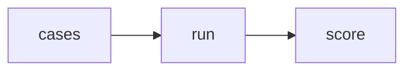

# Lab 2: Agent evals

After this lab a fixture list printed a pass count.

## Data
- Script: `lab2_agent_evals.py`

## Information
Cases in, score out.

## Knowledge
1. Load cases.
2. Run the target.
3. Print N/M.

## Wisdom
Not LangSmith.

## The When and Why
- **When:** you need a number.
- **Why:** vibes are not a score.

## How it works



## Data contract
`{pass: int, total: int}`

## Run

```bash
python education/12_reliability/lab2_agent_evals.py
```

## What you should see
A printed score.

## What this becomes later
Chapter 15 gates releases on this.

## Related
- **pytest:** same job for code.

## Notes

