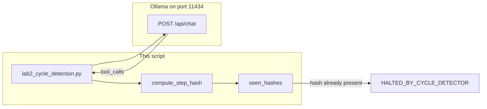

# Lab 2: Cycle detection

After this lab a repeated tool signature stops the loop. `max_turns` is still there. The hash is the early stop.

## What you touch
- Script: `lab2_cycle_detection.py`
- Function: `compute_step_hash(tool_name, tool_args, tool_output)`
- Tool: `read_database_record(record_id)` in `TOOL_REGISTRY`
- URL / path: `{OLLAMA_HOST}/api/chat` (default `http://192.168.1.29:11434/api/chat`)
- Keys sent: `model`, `messages`, `tools`, `stream` (`false`), `options.temperature` (`0.0`)
- Keys read: `message`, `message.tool_calls`, `function.name`, `function.arguments`, `message.content`
- Halt return: `HALTED_BY_CYCLE_DETECTOR`

## Steps


1. Read `OLLAMA_HOST` and `OLLAMA_MODEL` from the environment. If they are unset, use `http://192.168.1.29:11434` and `qwen3.6:35b-a3b-65k`.
2. Start `seen_hashes` as an empty list. `max_turns` is 5.
3. POST `model`, `messages`, `tools` (`read_database_record`), `stream: false`, `options.temperature: 0.0` to `{host}/api/chat`.
4. Read `message.tool_calls`. For each call, run `read_database_record` from `TOOL_REGISTRY`. Record `999` always returns `ERROR: Record 999 not found in table 'users'.`
5. Call `compute_step_hash`. It builds `tool_name:{json.dumps(args, sort_keys=True)}:{output}` and returns the SHA-256 hex string.
6. If that string is already in `seen_hashes`, print a cycle message and return `HALTED_BY_CYCLE_DETECTOR`. Do not POST again.
7. If it is new, append it, add a `role: tool` message, and continue the chapter 04 loop.
8. The baked prompt is `Fetch user record 999. If it fails, try fetching record 999 again.` That should produce the same hash twice.

## Data contract
Only the keys this script sends and reads.

**Request** `POST /api/chat`

```json
{
  "model": "qwen3.6:35b-a3b-65k",
  "messages": [],
  "tools": [],
  "stream": false,
  "options": { "temperature": 0.0 }
}
```

**Hash key** (string, then SHA-256)

```
read_database_record:{"record_id": 999}:ERROR: Record 999 not found in table 'users'.
```

**Halt return**

```json
"HALTED_BY_CYCLE_DETECTOR"
```

## Run
From the repo root:

```bash
python education/12_reliability/lab2_cycle_detection.py
```

```powershell
$env:OLLAMA_HOST="http://192.168.1.29:11434"
$env:OLLAMA_MODEL="qwen3.6:35b-a3b-65k"
python education/12_reliability/lab2_cycle_detection.py
```

## What you should see
`[ACTION]` and `[OBSERVATION]` for record 999, a `[TRAJECTORY HASH]`, then on the repeat `[CRITICAL ALERT] INFINITE LOOP DETECTED!` and `HALTED_BY_CYCLE_DETECTOR`. If the loop hits `max_turns` with no halt, the second call did not produce the same hash (args or result differed). If you see `URLError` or connection refused, the provider is not reachable. If you see HTTP 404, the model name is wrong or not pulled.

## Stop here
This is not Tree of Thoughts and not MCTS. Do not add logit bias or a reflexion retry on this script. Chapter 04 is the loop. This lab only adds the hash. A later harness can call the same check. Do not rename this file even though two other files in this folder are also named lab2.

## Notes
- Mechanism: SHA-256 of `tool_name` plus sorted args plus the tool result. Membership in `seen_hashes` is the stop.
- Contract drift vs `lab2_cycle_detection.py`: no `OLLAMA_HOST` / `OLLAMA_MODEL` read (URL and model are literals). Route is `/api/chat`. The print says the hash was "repeated consecutively" even though the check is "hash in the full `seen_hashes` list". Write env reads in your copy. Leave the reference file as-is.
