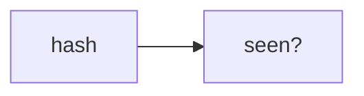

# Lab 2: Cycle detection

After this lab a repeated tool signature raised or stopped.

## Data
- Script: `lab2_cycle_detection.py`

## Information
Hash last signatures.

## Knowledge
1. Record hashes.
2. Repeat a call.
3. See the stop.

## Wisdom
Not ToT.

## The When and Why
- **When:** the loop repeats.
- **Why:** max_turns is late.

## How it works



## Data contract
hash string

## Run

```bash
python education/12_reliability/lab2_cycle_detection.py
```

## What you should see
A cycle message.

## What this becomes later
Harness chapter uses this.

## Related
- **Chapter 04:** the loop.

## Notes

