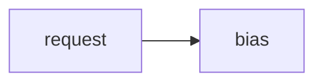

# Lab 2: Logit steering

After this lab a banned token did not appear.

## Data
- Script: `lab2_logit_steering.py`

## Information
Bias or stop string on the request.

## Knowledge
1. Set a constraint.
2. POST.
3. Confirm the token is absent.

## Wisdom
Not a full CFG engine.

## The When and Why
- **When:** you must forbid a string.
- **Why:** prompt-only bans fail.

## How it works



## Data contract
options / logit_bias keys as in the script

## Run

```bash
python education/12_reliability/lab2_logit_steering.py
```

## What you should see
Output without the banned token.

## What this becomes later
Evals can score this.

## Related
- **Chapter 02 JSON:** another constraint.

## Notes

