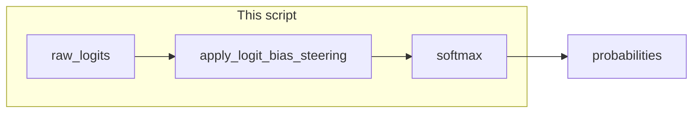

# Lab 2: Logit steering

After this lab a banned token is near-zero probability. Prompt-only bans are not enough. A number on the token id is.

## What you touch
- Script: `lab2_logit_steering.py`
- Functions: `apply_logit_bias_steering(raw_logits, logit_bias)`, `softmax(logits)`
- Table: `VOCAB_TABLE` (`{` is 101, `I` is 201, `apologize` is 202, `cannot` is 203)
- Intended URL / path: `{OLLAMA_HOST}/api/generate` (default `http://192.168.1.29:11434/api/generate`)
- Intended keys sent: `model`, `prompt`, `stream` (`false`), `options.temperature` (`0.0`), plus a bias map or a stop string
- What the reference actually touches: local dicts only. No HTTP.

## Steps


1. Read `OLLAMA_HOST` and `OLLAMA_MODEL` from the environment if you POST. The reference script does not POST.
2. Set a constraint. The lab bans `apologize` and `cannot` with bias `-100.0` and boosts `{` with `+5.0`. A stop string is the other option: tell the provider to halt when it emits that string.
3. Intended path: POST the constraint on the request (`options` or a `logit_bias` map) and confirm the banned token is absent in `response`.
4. Reference path: call `apply_logit_bias_steering` on `raw_logits`, then `softmax`. Print probabilities before and after.
5. Confirm `apologize` and `cannot` drop near zero and `{` rises. That is the banned token not appearing.
6. Do not build a full CFG (grammar) engine.

## Data contract
Intended request if you POST. The reference uses the local maps instead.

**Intended request** `POST /api/generate`

```json
{
  "model": "qwen3.6:35b-a3b-65k",
  "prompt": "string",
  "stream": false,
  "options": { "temperature": 0.0, "stop": [] },
  "logit_bias": { "202": -100.0, "203": -100.0, "101": 5.0 }
}
```

Ollama may not honor `logit_bias`. A `stop` list on `options` is the portable halt. The idea is still a constraint on the request, not a prompt-only ban.

**Reference inputs** (local, no HTTP)

```json
{
  "raw_logits": { "101": 2.0, "201": 4.5, "202": 5.0, "203": 4.8 },
  "logit_bias": { "202": -100.0, "203": -100.0, "101": 5.0 }
}
```

## Run
From the repo root:

```bash
python education/12_reliability/lab2_logit_steering.py
```

```powershell
$env:OLLAMA_HOST="http://192.168.1.29:11434"
$env:OLLAMA_MODEL="qwen3.6:35b-a3b-65k"
python education/12_reliability/lab2_logit_steering.py
```

The env vars are unused by the reference script. They are here so a POST copy matches the other labs.

## What you should see
Un-steered probabilities, then steered ones. `apologize` and `cannot` should be about `0.00%`. `{` should be the largest. If the banned tokens stay high, the bias was not added. The reference also prints two extra guardrail checks (prompt injection and JSON). Those are not this lab's idea.

## Stop here
This is not a CFG engine and not a full guardrail product. Do not add cycle hashing or a reflexion retry on this script. Evals (the next lab2 file) can score whether a banned token appeared. Do not rename this file even though two other files in this folder are also named lab2.

## Notes
- Mechanism: add a float to a token id, then softmax. Prompt-only bans fail because the model can still emit the word.
- Contract drift vs `lab2_logit_steering.py`: no HTTP, no Ollama, no `OLLAMA_HOST` / `OLLAMA_MODEL`. The script also runs `GuardrailInterceptor.inspect_prompt` and `validate_output`. Those are extra. The intended contract is a bias map or stop string on the request, then a reply without the banned token. Write that in your copy. Leave the reference file as-is.
