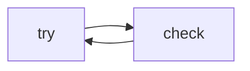

# Lab 3: Reflexion loop

After this lab a failed check produced a second, better attempt.

## Data
- Script: `lab3_reflexion_loop.py`

## Information
Append the error, call again.

## Knowledge
1. First answer.
2. Fail a check.
3. Retry with the error in context.

## Wisdom
Not a new model.

## The When and Why
- **When:** you have a checker.
- **Why:** the model repeats otherwise.

## How it works



## Data contract
error string in messages

## Run

```bash
python education/12_reliability/lab3_reflexion_loop.py
```

## What you should see
Two attempts, second closer to the check.

## What this becomes later
Evals score many of these.

## Related
- **Chapter 04 loop:** the outer for.

## Notes

