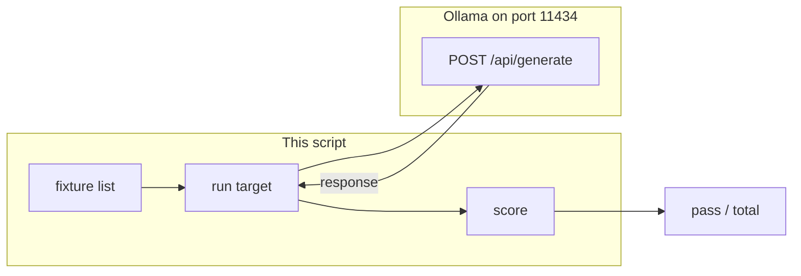

# Lab 4: Agent evals

After this lab a fixture list printed a pass count. Vibes are not a score. A number is.

## What you touch
- Script: `lab4_agent_evals.py`
- Intended function: a score over a list of cases
- URL / path: `{OLLAMA_HOST}/api/generate` (default `http://192.168.1.29:11434/api/generate`)
- Keys sent: `model`, `prompt`, `stream` (`false`), `options.temperature` (`0.0`)
- Keys read: `response`
- Intended result: `{ "pass": 0, "total": 0 }` plus one `{ "case", "pass" }` row per case

## Steps


1. Read `OLLAMA_HOST` and `OLLAMA_MODEL` from the environment. If they are unset, use `http://192.168.1.29:11434` and `qwen3.6:35b-a3b-65k`.
2. Load a fixture list. Each case is a prompt plus a check (string contains, JSON parse, or a boolean you wrote).
3. For each case, POST `model`, `prompt`, `stream: false`, `options.temperature: 0.0` to `{host}/api/generate`. Read `response`.
4. Run the check. Record `{ "case": "string", "pass": true }`.
5. Print N/M (pass count over total). That is `{ "pass": n, "total": m }`.
6. Do not stand up LangSmith, a trace backend, or a dashboard.

## Data contract
Intended score shape. The reference script prints something else. See Notes.

**Request** `POST /api/generate`

```json
{
  "model": "qwen3.6:35b-a3b-65k",
  "prompt": "string",
  "stream": false,
  "options": { "temperature": 0.0 }
}
```

**Intended row**

```json
{
  "case": "string",
  "pass": true
}
```

**Intended summary**

```json
{
  "pass": 0,
  "total": 0
}
```

## Run
Copy `.env.example` to `.env` in the repo root and uncomment the Ollama lines. The script loads that file (it does not override vars already set in the shell).

From the repo root:

```bash
python education/12_reliability/lab4_agent_evals.py
```

```powershell
python education/12_reliability/lab4_agent_evals.py
```

## What you should see
A printed score: how many cases passed out of how many ran. The reference script instead prints an OpenTelemetry-style span list and a judge JSON with `score`, `verdict`, and `reason`. If you see `URLError` or connection refused, the provider is not reachable. If you see HTTP 404, the model name is wrong or not pulled. If `json.loads` fails on the judge reply, the model did not return a single JSON object.

## Stop here
This is not LangSmith and not a release dashboard. Chapter 15 can gate a release on a pass count. Do not add reflexion retries on this script.

## Notes
- Mechanism: cases in, boolean per case, N/M out. Same job as pytest, for model text.
- Contract drift vs `lab4_agent_evals.py`: no fixture list and no `{ "pass", "total" }`. No `OLLAMA_HOST` / `OLLAMA_MODEL` read (URL and model are literals). The script builds `AgentTracer` spans (`trace_id`, `span_id`, `duration_ms`, a mock `tool.execution` span) and calls `llm_judge_evaluator`, which POSTs a second generate and expects `{ "score": 0 to 100, "verdict": "PASSED" or "FAILED", "reason": "string" }`. The baked task is one factorial prompt, not a list. The intended contract is still a case list and a pass count. Write that in your copy. Leave the reference file as-is.
