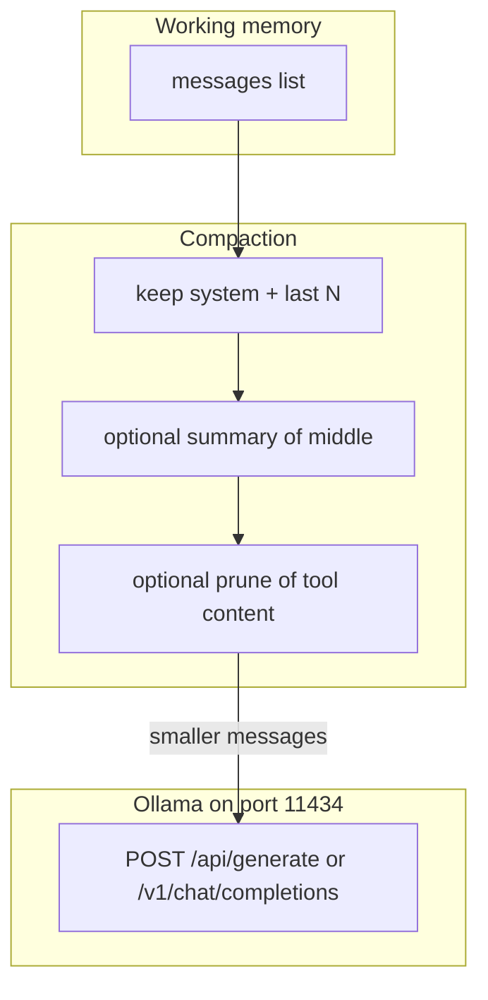

# 13: Context engine

After this chapter the message list can shrink. You keep the system message and the last N turns, or you replace the middle with a summary. This chapter does not add a vector store.

## Data
Chapter 05 writes the `messages` list to a file or a SQLite row. That list is the working memory: the exact JSON you would send on the next `POST /api/generate` or `POST /v1/chat/completions`. Every turn appends another object with `role` and `content`. The list grows.

**Working memory** is that payload. It lives in RAM as a Python list, then goes in the POST body under `messages` (chat) or is flattened into `prompt` (generate).

**Compaction** is any step that makes that list smaller before the next POST. Three ways:

1. **Window:** drop old turns. Keep the system message and the last N user/assistant pairs.
2. **Summary:** replace the dropped middle with one assistant (or system) message that states what happened.
3. **Prune:** trim long tool stdout or other bulky `content` strings so one turn is smaller.

There is no compaction script in this folder. The idea is still the list, the count, and the smaller list you POST.

`OLLAMA_HOST` should default to `http://192.168.1.29:11434`. `OLLAMA_MODEL` should default to `qwen3.6:35b-a3b-65k`. The route is still `POST /api/generate` or `POST /v1/chat/completions`. Compaction changes the body, not the host.

## Information
Chapter 05 saves the list so a restart can load it. This chapter makes the loaded list smaller so the next POST still fits.

A long `messages` list has two costs:

1. **TTFT** (time to first token) grows because the provider must read every token in the prompt before it starts the reply.
2. **Cost and context limit:** more tokens in means more money on a cloud API, or an HTTP 400 / context overflow when the local window is full.

Count tokens if you have a tokenizer. Count characters if you do not. Either number is a size. When the size is too large, compact, then POST.

Vector search (RAG) is `02_private_rag.md` and `lab3_local_private_rag.py`. Do not add a vector DB on this page. This page only shrinks the list you already have.

## Knowledge
1. After you load or build `messages`, measure size: `len(json.dumps(messages))` for characters, or a token count if you have one.
2. Keep the system message (first item with `role: "system"`) and the last N turns (user/assistant pairs). Drop the middle.
3. Optionally POST the dropped middle to `{OLLAMA_HOST}/api/generate` with a prompt that asks for a short summary, then insert one message in the gap.
4. Optionally trim long `content` on tool-result messages (stdout, file dumps) to a character cap.
5. POST the smaller list. Do not add Chroma, embeddings, or a retrieval query here.

## Wisdom
Stop when the next POST uses a shorter list and still has the system message plus recent turns. Do not add a vector database, episodic memory, or a codebase index on this page. Those are the next files in this folder. If you add them now, a bad answer could come from the window, the summary, or retrieval.

## The When and Why
- **When:** the `messages` list no longer fits the model context, or TTFT and cost are growing with the raw history.
- **Why:** the provider reads the whole prompt before the first output token. A smaller list is a faster, cheaper POST that still fits the context window.

## How it works



Walkthrough of one compact-then-POST:

1. You have a `messages` list from chapter 05 (RAM, JSON file, or `checkpoints.db`).
2. You count characters or tokens. If the size is over your cap, you keep `messages[0]` when it is the system message, keep the last N items, and drop the rest.
3. If you want a summary, you POST the dropped turns as a `prompt` to `{OLLAMA_HOST}/api/generate` and insert the `response` text as one message in the middle.
4. If a tool message has a huge `content` string, you slice it to a max length.
5. You POST the new list. The host and model are unchanged.

Nothing in that walkthrough opens a vector store. The new work is the smaller list.

## Data contract

**Intended compact result** (what you POST after the window)

Keep: system + last N messages.

```json
{
  "model": "qwen3.6:35b-a3b-65k",
  "messages": [
    { "role": "system", "content": "string" },
    { "role": "user", "content": "string" },
    { "role": "assistant", "content": "string" }
  ]
}
```

On native generate, the same list is flattened into `prompt`. `stream` can be false. `options.temperature` can be `0.0` if you want a repeatable summary.

There is no compaction `.py` in this folder. The intended contract is still system + last N, optional summary message, then POST.

## Lab
Done when you can name the three compaction moves (window, summary, prune) and say which keys stay in the POST.

- Module: [this file](./00_context_engine.md)
- Lab 1 (missing): compact a long `messages` list, then POST. See [STUB_lab1_context_window.md](./STUB_lab1_context_window.md) after it is added.
- Lab 3 (this folder): [lab3_local_private_rag.py](./lab3_local_private_rag.py) / [lab3_local_private_rag.md](./lab3_local_private_rag.md) — vector RAG, not compaction.

## Related
- **Chapter 05:** saves the list. This chapter shrinks it.
- **02_private_rag.md:** retrieval from a vector store. Different job.
- **01_agentic_memory.md:** episodic vs procedural memory. Different job.

## Notes
- Moved from modules/12. The old folder name does not change the idea.
- No paired `.py` for compaction. Do not treat lab 3 as the compaction lab. Lab 3 is RAG.
